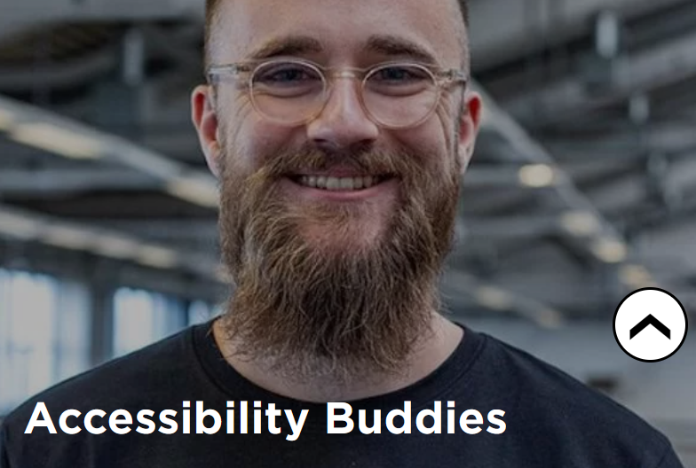
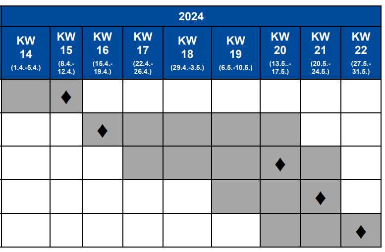

# Welcome (**KHG Person?**)

[This now live!](https://www.jku.at/lit-open-innovation-center/open-innovation-in-science/community-call/challenges/), see (working title) "Accessibility Buddies" (DE).

## "Efficient and effective preparation of accessible PDF documents for Inclusion"

To summarize and from my perspective: I need help with the four points below to check assumptions and clean up data going into a **Masters thesis**, but I think the potential of the project outlined here goes beyond an academic research project alone and I am happy and honored that [LIFT_C (Institute for Transformative Change)](https://www.jku.at/lift-c/) and the [OIC (Open Innovation Center)](https://www.jku.at/campus/der-jku-campus/campusfuehrung/self-guided-jku-campus-tour/oic/)/[Open Innovation in Science](https://www.jku.at/lit-open-innovation-center/open-innovation-in-science/) (with [LBG (Ludwig Boltzmann Gesellschaft)](https://ois.lbg.ac.at/)) agree. 

**Read on for an opportunity that might be interesting to you!**
# Fellowship Opportunity April and May 2024 (2600 EUR total (p.P.) research employment with JKU's Open Innovation Center included)

The cool thing is, for **any AI Bachelors or Masters students that want to get involved, especially,** that the fellowship offers both credits and money: 3 ECTS and 2 Months (April and May 2024) employment a 20 hrs/wk and 1299.60 EUR/M, so ca. 2600 EUR total for this project, can be offered for continuous contributions in this time period. Since I am living at [KHG](https://www.dioezese-linz.at/khg/leben), the academic catholic society in Linz, and its JKU center is right by OIC/LIFT_C geographically speaking, my idea is to advertize this to this community especially. (Professors at two of the three backing institutes, IIS, Institute of Integrated Study at JKU, and FAW, Institute for Application-oriented Knowledge Processing, also at JKU), might also nominate.)

**Nominations will happen by March 15th!** If interested please apply now (early March).
# Applications: Apply Now!

***These are done informally at KHG at this point. Just reach out to [Jack](mailto:jack.heseltine@gmail.com) now, +43 664 965 3008! We are doing this fast**, no paper application required. A resume if you have it would be nice, or reference projects, IF you have those, that is all: but this can be an entry to ML/scientific projects for you, to be sure.*

Your incentive is 2600 EUR cumulatively and 3 ECTS (associated course: [Update Social: Building Future Communities](https://www.jku.at/lit-open-innovation-center/open-innovation-in-science/lehre-und-weiterbildung/updatesocial/)), which is also nice. You will need to invest the time. You will also have some extra lectures and events, but likely also extras like coffee and snacks and a fancy evening event sometime in June.

There is an official [project proposal](../../assets/pdf/JKU_CommunityCall_Antrag_Final_Rework.pdf) (DE) by the way, if you need that for reference. Fellowship distribution is happening informally and fast, but the project is serious (enough).

What are the **four areas** that need to be fleshed out for this project, aligning with the four fellowships? 

And what does fleshing out mean, firstly? I'd say developing concepts and prototypes, which is a realistic goal for the two month period. Anything further, i.e. any actual implementation of a project, would need to happen later and in a different format. A likely outcome of this iteration is a short presentation contribution, of the following topic areas for example; not everyone needs to present, to be sure: [Science Communicator](#science-communicator), anyone?

# 4 Topic Areas/Questions for 4 Fellows

## What tool would be like to work in? 

### Helpful Skill: Software Engineering

Right now I am looking at [Alfresco/ECM](/) for this but can take over this part, as this more niche and technical. 

*This would be the **Builder** role, if we want to look at it this way.*

## How does the LLM concept work in detail and to what degree is it feasible?

### Helpful Skill: General AI background, critical thinking, etc.

We want to process documents to make them accessible. But does the concept track fully? To what degree if not? Please reference the [project proposal](../../assets/pdf/JKU_CommunityCall_Antrag_Final_Rework.pdf) for more details on the concept. 

*This is an **ML/LLM-Tinkerer** role, maybe, though might be more abstract and big picture.*

## What is the data situation and how can it be improved?

### Helpful Skill: Data Science and ML

This will happen in coordination with IIS: there is a solid data set already! More info on this when the project starts. 

*This is the **Data Scientist** role!*

## What is the Bigger Picture? What might a service model look like for JKU?

### Helpful Skill: General AI background, Science Communication!

The service model idea is part of this project as well as there is a legislative need currently, mainly  due to the [European Accessibility Act](https://ec.europa.eu/social/main.jsp?catId=1202).

Once, again please see [project proposal](../../assets/pdf/JKU_CommunityCall_Antrag_Final_Rework.pdf) for details on the context.

*I see this as a communicative, **Presenter**-type role.*

# Timeline

See also in the [project proposal](../../assets/pdf/JKU_CommunityCall_Antrag_Final_Rework.pdf) for details about the milestones, diamond shapes in the table below.

# Fellows and Skills

This is an open call and anyone with any skills is welcome, despite the listings above. These might also include:

* CS and/or Software Engineering
* AI, Data Science and LLMs
* Medical Engineering
* UI and Design
* Digital Society
* Education

*Looking forward, Jack*

*March 2nd, 2024.*

