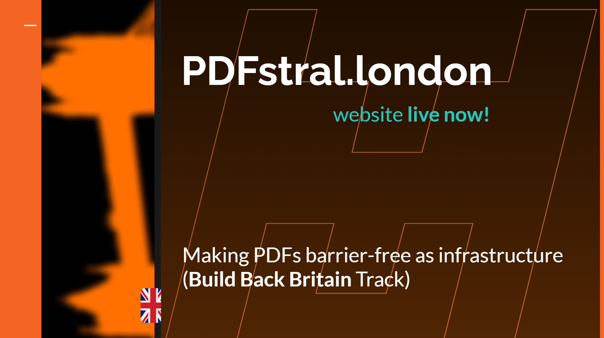

_From the **[devpost](https://devpost.com/software/pdfstral?ref_content=my-projects-tab&ref_feature=my_projects)**! This is a working prototype developed in London over the [weekend of October 4th to 6th, 2024, and as part of a the Mistral AI x a16z (Andreessen Horowitz) Hackathon](https://hackukmistral.devpost.com/), implementing the [idea outlined as part of Update Social in Linz this spring](https://heseltime.github.io/notes) - just see the relevant rX-post here._

## Inspiration
Accessibility is a super important topic that many people are not aware of, simply because it does not impact them directly. The new LLM tooling landscape promises to remove the manual workload previously stopping every single publicly available PDF (since it is the most common format, as everyone knows) document to be available to not just vision-impaired people but also other groups, which is why we wanted to make a proof-of-concept to tackle this important issue.

## What it does
PDF Upload & Processing: Users can upload a PDF file for processing via a file uploader widget. Structure Tree Visualization: If the PDF already contains a tagging tree structure tree, commonly used to various levels of success to make documents accessible, the app lets users investigate that structure, assisted by the Mistal API, profiting from larger context windows. Text and Markdown Extraction: PDF content is extracted and converted into markdown format. The markdown includes the text and structure extracted from the PDF. Image Extraction and Description: Images from the PDF are identified and extracted from each page. The app sends these images to the Mistral API and specifically Pixtral 12B to generate descriptions, which are returned as markdown-formatted image annotations. Text-to-Speech Conversion (Bonus, not originally part of the project idea): Using the gTTS (Google Text-to-Speech) library, the app converts the extracted text from the PDF into an MP3 file. This demos screen-reader side capabilities as well. A downloadable audio file of the entire document's content, including text and image descriptions, is made available. PDF & Markdown Export: After processing the document, users can download:

## The extracted markdown (which includes the full text, structure, and image descriptions).
An accessible PDF version created from the markdown content.
An MP3 file of the document's audio generated from the text content. Interactive Features: The app displays the PDF's structure, text, and image descriptions in real-time. Download buttons for markdown, audio, and a converted PDF are available to the user.

##How we built it
We used a python stack specifically using streamlit as the app framework, Mistral API calls, pymupdf and pymupdf4llm for PDF processing, markdownpdf for markdown-related processing, and also pikepdf for some more PDF heavy-lifting. Not too bad for a Saturday afternoon/evening and Sunday morning. We did work late into the night, but did not pull an all-nighter, by the way, and since this is a hackathon after all.

## Challenges we ran into
PDF-side: we went pretty far with python packages but researched that java and .net offer deeper PDF capabilities, making for a potential future direction.

## Accomplishments that we're proud of
Although our team size decreased by one third on the way, we are proud that we accomplished what we set out to do, and then some, since we were pretty impressed by just how good multi-modal by Pixtral 12B really is. This particular use case shows a real, impactful way to put these new capabilities to use, whether in the UK or elsewhere, and our proof-of-concept shows a potential way.

Also, in and of itself, our little app might even be used for real assistance already, providing additional pdf rendering and speech synthesis capabilities we were able to implement on the way, though clearly would need further development to be a solid product.

## What we learned
About Pixtral 12B, and the Mistral dev environment, generally: all super impressive, want to use in the future. Fintetuning and RAGs are topics we barely touched, but we learned at the Hackathon that that work is also within direct reach from where we are now.

## What's next for PDFstral
Two things: this project ties in with a Masters Thesis currently being written at Johannes Kepler University in Linz, and would benefit from some validation and testing of results. Apart from this, exploring more sophisticated PDF libraries and how these might integrate with Mistral's API are on our roadmap, ESPECIALLY if we win some compute credits or similar.

## Built With

* pikepdf
* pymupdf and pymupdf4llm
* streamlit
* poetry

## Try It Out

Short-term vanity link: pdfstral.london/

Longer-term link: https://pdfstral.streamlit.app/

## More

[Companion Slides](https://docs.google.com/presentation/d/18mkzttmRAo7kTcdBRxyERATSdmqt9ODidUBlRLN30Mg/edit?usp=sharing):

Team: [Jack](https://www.linkedin.com/in/heselt-in-e/), [Akshay](https://www.linkedin.com/in/akshayakula/)