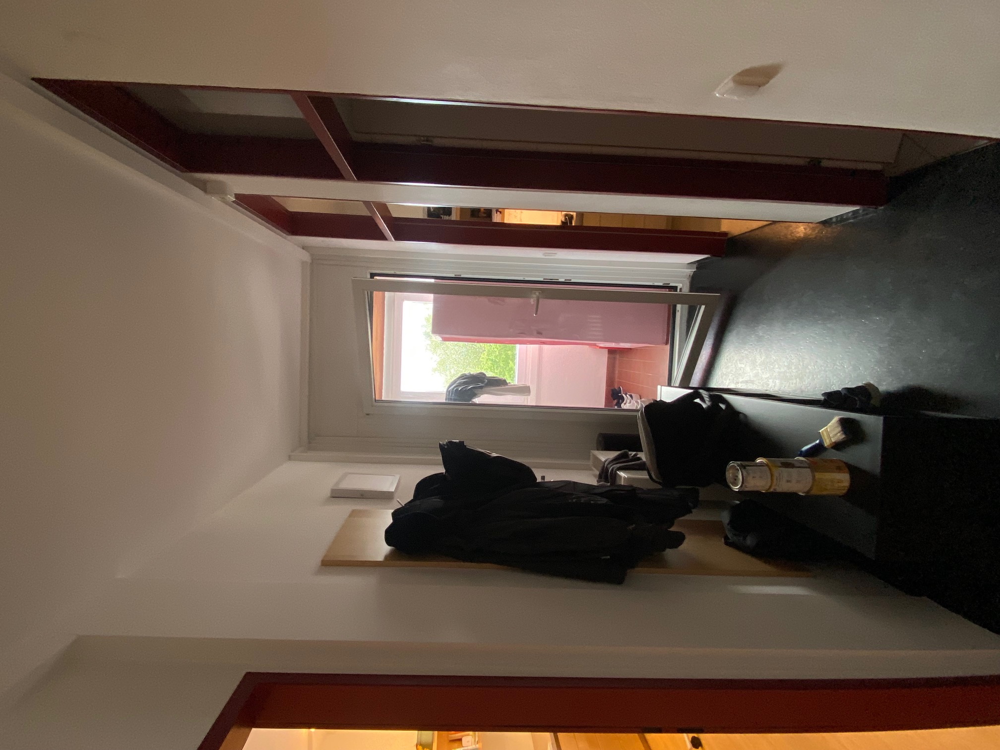

Thank you for stopping by! 

Looking for a safe and clean room/bed/base with direct access to Johannes Kepler University (JKU) in Linz, Austria, for work and/or school and the short term? **You have come to the right place.**

# Overview #

Situated at Katholische Hochschulgemeinde (KHG), the Catholic Academic Society, at JKU, in the top floor, the small apartment is occupied during most weeks but is often free on the weekends and as such, is offered for booking as a short-term sublet in accordance with KHG policy. 

At a minimum the convertible couch-bed depicted below is available in the living room (at a discount), or in the case that the whole apartment is free, you have you own (double) bed and bed room, in addition to said living room, also with kitchen and separated working area, and a bathroom and small balcony.

# Summer Availability #

**This apartment goes up on [the Linz ÖH/JKU Wohnungsbörse](https://oeh.jku.at/wohnungen/) whenever available!**

The apartment is located on the 5th floor of the KHG, the Catholic University Community (KHG), and is available in the summers, generally. There is access to a cellar compartment, and partial cafeteria operation (lunch) during the summer. It is a sublet with the consent of the KHG management.

The apartment is friendly and bright, cleaned every two weeks (summer schedule may change), and offers modern equipment in the kitchen and bathroom. The furniture is built-in, which keeps the available space open. There is a large sofa bed for guests, as well as a dining table in the kitchen, which is integrated into the living room. The bedroom is separate with a double bed. Both the sleeping and living rooms have a workspace, making the apartment suitable for a working/studying couple. Viewings are now possible during the summer semester, just **call or send a Whatsapp message: +43 664 9653008**

The rent includes utilities and is passed on at the KHG price. The apartment is actually available from June 24 and then continuously throughout the summer until the end of September. Ideally, I would like to rent it out continuously from July 1 (or June 24) to October 1. A returnable security deposit of two months' rent is required.

# Floor Plan #

# Photos #

Let's take a tour.

