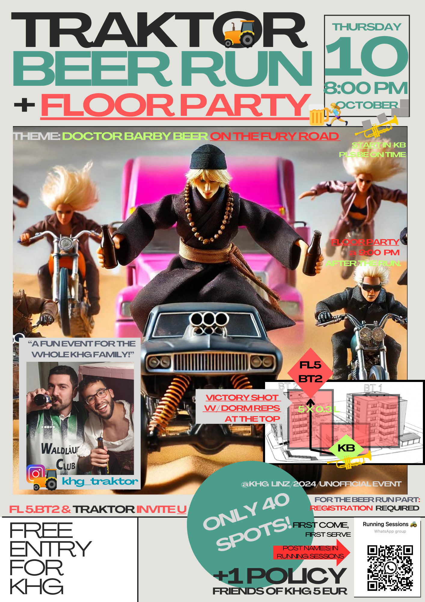

# Misc./Reflections on "Life", "Having a Life" @KHG

## Introduction

"Ein Leben (haben)", (having) a life, that was the majority counter-argument to academic zeal in high school, at least in my class, where an in-group would define itself (against those who preferred books) by those who even in young years seemed to be living some kind of totally-on-the-nose middle-class dream of cars, parties and day-trips. But:

> The book Die Durchschnittsfalle (The Average Trap) is by geneticist Markus Hengstschläger. It discusses genes, talents, and opportunities and claims that mediocrity is the favorite of Austrians, leading the country into an evolutionary dead end. "The average has never achieved anything innovative. A father proudly says, 'My son is so easy-going, he's never been noticed negatively.' But standing out positively isn't wanted either, because that would cause stress. Society always strives for the average. How, for example, should an average grade determine whether someone will be a good doctor? The statistical average does not lead us forward and is not suited for the future.

(Bishop of Linz, Manfred Scheuer)

Taken from the sermon at my confirmation, shortly after moving into KHG: yes, they got me. And I am happy for it.

Needless to say I wasn't _in_ the in-group in high school, at times even at odds with the majority. And sadly, quite lonely, and, nerdy too, making for what I consider now a difficult time, looking back: and this despite a pretty much perfect grade average, straight As. 

Fast-forward some years, I left the country for college, did ok in the US culture of glorifying work and zeal, of course, but rediscovered certain community (and religious, too) values when returning to Austria for work in non-profit at a Red Cross IT department after college during Covid, and then staying on for grad school, living at home initially during the hot phase of the pandemic, and then moving to a small flat on the Danube in Linz, and finally another small flat inside a Catholic Dorm actually (for the really trivial reason of needing to be closer to my university, not even sensing that I might benefit from the extra value that such a place has to offer): as for the setup, the [top (fifth) floor is single's apartments (me)](/551) or rooms in shared flats, left from the time when the kitchen chef, pastoral assistant and economic director (head) still lived on premises, subsequently converted to student living space, and the first four floors are single's or shared rooms for younger students at a cheaper price tag.

## The KHG in Linz: The Catholic Society

I found _I needed a life **now**_ to be able to continue on and also excel academically, as well as professionally, as I am doing my hybrid project of continuing grad studies while working, at least to Masters: pretty much a therapeutic counter-measure to, let's say it, the sadness, social anxiety and unease I find to be present in me and my life if I don't do what I was heartily invited to do at the catholic dorm. I will go into this in a moment, but first, some more on this dorm. 

It is a relic from a time when Catholic culture was nearer to mainstream establishment than it is now. Uniquely to Upper Austria, where this was particularly pronounced, the building itself (counterparts exist in the other states of Austria) is large, housing 140 students. In the old days, these would have been all rather devout catholics, participating not just in communal, but religious life too, in the form of church services, pilgrimages and so on. Of course not everybody, and don't get an overly conservative idea: from the beginning, the place was known to be spiritally minded, in the Catholic sense, but going against the grain of a self-involved, clinging - to the past, to authority, whatever - church, fitting for a town-and-gown type story at the university location.

For me, some 50 years on from the birth of KHG, as Covid-19 settled: From the start I was pretty much thrown into life in the community. I later read Bell Hooks' _All About Love_ and particularly the chapter "Community: Loving Communion" seems to capture the spirit of the place, now made up half-half of more or less religious (Upper) Austrians and (just as often non-religious) internationals, surely in large part due to a whole team of pastoral assistants. This is something the church does for young people at the university here (the church _does_ balance the books of the place, which does of course its own money too, from student living) - and this cooperation works. **Certainly for me: I don't want to leave!**

So for my grad studies now towards completion of my Masters and possibly beyond, I am trying to make the most of my time here, very much in agreement with that Bell Hooks quote of Parker Palmer about the interplay of the individual and internal on the one side, and the outside community on the other (grateful to have found this and at times wishing I had done so sooner, but appreciating that maybe _losing_ this - I think we all have an undivided life in childhood - is the precondition for finding it).

> Community cannot take root in a divided life. Long before community assumes external shape and form, it must be present as a seed in the undivided self: only as we are in communion with ourselves can we find community with others."

## Community in General

I am reminded of my experience at Sarah Lawrence College, the small liberal arts college just outside NYC I called home for four years after school: but I find the relgious dimension (the college was a very secular place) adds an important social and spiritual dimension I need addressed in my life, to say the least on this topic for now. 

Let's bring it back to the basics: What makes a community a _real_ community, to my categories something more like Sarah Lawrence, less like my high school? A note here: looking back to school, I can tell traces of community, vestiges and remaining friendships from middle school, group building encouragements were there, but just like the others (surely!) failed at making everyone feel a part of the group, so _did_ I, and the cost is, simply, a no-community. It feels terrible: but the time of transition from middle to high school, and those years particularly, something about that ... And so, I think it could have been done better, school and even to a degree college, and that part would have been up to me too, to take responsibility here. It has to do with a deeply personal relationship, that of one to oneself.

Bell Hooks quotes M. Scott Peck in this regard:

> The goal of genuine community is "to seek ways in which to live with ourselves and others in love and peace."

The alternative is division, both within and without, lack of love, strife.

## Living Community at KHG

But what does the community life mean, concretely? Here is how I find and give community at KHG, nowadays.

### KHJ: Catholic University Youth (Upper Austria)

Partly because I seem to get the importance of this stuff, which is really the same as saying I am the right place in my life for it, I was promoted to the office of KHJ student president basically, for lack of a better translation from the German "Vorstand" - my take: I serve community and community building in general, this is the tangible difference relgion and church can make in the lives of the other students I live with.

[See a slide show on this for the presentation I am giving currently to new incoming students (Google Slides).](https://docs.google.com/presentation/d/1qAb85NZwXKXToALrVz9pXuyoZqWJsNY2Y1SSw9AjCWc/edit?usp=sharing)

### Theater Group M23

The group's name comes from KHG's address. Last semester we performed a piece which totally speaks to my taste actually. By [Werner Schwab](https://en.wikipedia.org/wiki/Werner_Schwab), an Austrian playwright, the play "Der reizende Reigen nach dem Reigen des reizenden Herrn Arthur Schnitzler" parodies Schnitzler (in a strange coincidence, my cousin performed in the original play the same semester) but also features surrealist and overtly sexual elements (where Schnitzler and sexual mores are precisely the topic) like detachable plastic sex organs. Totally **not** what you would expect at a Catholic Society, which is why I particularly enjoyed this.

But aside from the literary value, the personal one is learning to understand theater as a tool to get me in tune with a group, to express myself, in fact really exercise vocals and facial muscles, emotion and sensory perception while speaking publicly, to name just a few of the hidden processes of theater I discovered - why did I hide from this so long? I know for a fact not only I am scared of getting up on stage though. Still, I think it took a setting like KHG and arriving at that magical (not really) place in life I mentioned to get me to do it = allow me to take the challenge.

### Quoir Group

_Something about signing in a group!_ (Another secret.)

### Tractor (Traktor in German) Sports Group

Why Traktor? You tell me! Fun sports (fun-sports) group with a an alcohol component (beer, this is Austria after all - but see next section for our, quite gay, take) sometimes. Also a Sauna Group division runs under this, maybe also a Climbing and Fight Club (Wrestling) one, but you don't talk about Fight Club. Also not my divison actually.

But I do see Traktor as something like the executive arm of KHJ, where the alcohol component might not make for great publicity for KHJ, so just hand it off ...

### Posters for everything else.

One more thing: at KHG I discovered that I really **love, love, love** making posters for different things, usually whacky events like sauna openings or beer runs (these two categories under the Tractor banner actually) - feedback has been mixed, I will admit, but the overloading of information - frequently criticised - is me selling an idea for an event, that I need to be able to map out on one poster (not in an essay like this.)

So, take and judge for yourself:

(Tools used: Canva, Dall-E for the image (generation), photo permissions!)

## Conclusion

KHG has become my home away from home, only one hour by train: friends from childhood have left said home and friends from high school are sparse, as I told you, so I appreciate the place for what it is and I think I fit into it well and can contribute, mainly through KHJ going forward: I see my position in both with the Upper Austrians and the Internationals as a happy coincidence, and the whole place and my life there as a good basis for academic performance, more than that even, a precondition. 

My education in this crucial area of life follows that of Bell Hooks:

> I learned that it is more fulfilling to live one's life within a circle of love, interacting with loved ones to whom we are committed. Lots of us learn this lesson the hard way by finding ourselves along and without meaningful connection to friends.

(All About Love)