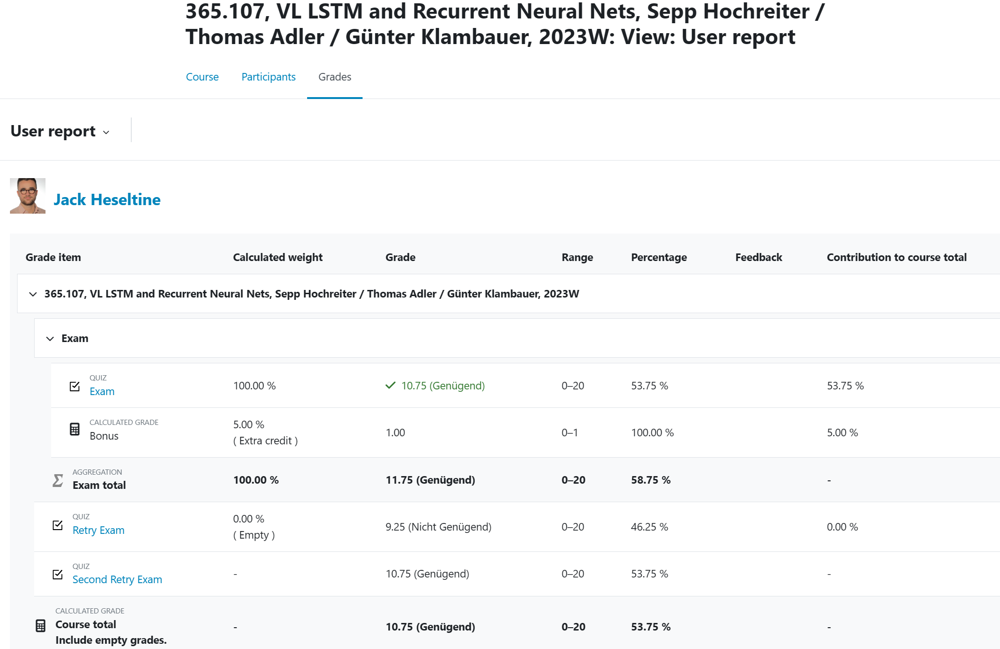

# Good Thing It's a Course Central To My Degree

Oh but it has a challenging final exam.

I took three attempts, failing the middle one, and (because the last grade counts) retaking another time, that time achieving _exactly_ the points I had the first time. 

My middle and high school self (straight As actually) would be appaled. I say, after checking with a super approachable lecturer: papers, blog posts, ... profile count, not only grades, especially if the exam is known the hard. The cool thing is, I am actually looking at potential post-grad study in this group, and they teach what they care about so that gives me a leg-up-

The down-side is, applying for outside schools and programs and fellowships/stipends and the like becomes harder.

One option was put on the table: I retake the exam in one year, when I am probably still in this Masters, and since this stuff (and I [like it actually](/rDai#lstm)) is central to my degree, try and do it from a place of practice. However, does that place translate to a perfect score? This might not be the case, since the questions are super convoluted and the whole setup ... well, let's say, grades really don't say everything here.

<nav class="nav">
    <ul class="nav__list">
        <a href="/" class="nav__link">
            <i class="ri-home-5-line"></i>
            
                Home
            
        </a>

        <a href="/notes" class="nav__link">
            <i class="ri-swap-line"></i>
            
                Feed
            
        </a>

        <a href="/portfolio" class="nav__link active-link">
            <i class="ri-slideshow-2-line"></i>
            
                Portfolio
            
        </a>

        <a href="/rDai" class="nav__link">
            <i class="ri-robot-line"></i>
            
                AI
            
        </a>

        <a href="/rDse" class="nav__link">
            <i class="ri-command-line"></i>
            
                Software
            
        </a>

        <svg class="indicator" width="94" height="56" xmlns="http://www.w3.org/2000/svg">
            <ellipse cx="47" cy="28" rx="24" ry="28"/>
            <path d="M24 20C24 20 28 55.9999 48 56L0 55.9997C18 55.9998 24 20 24 20Z"/>
            <path d="M70 20C70 20 66 55.9999 46 56L94 55.9997C76 55.9998 70 20 70 20Z"/>
        </svg>
    </ul>

    
</nav>