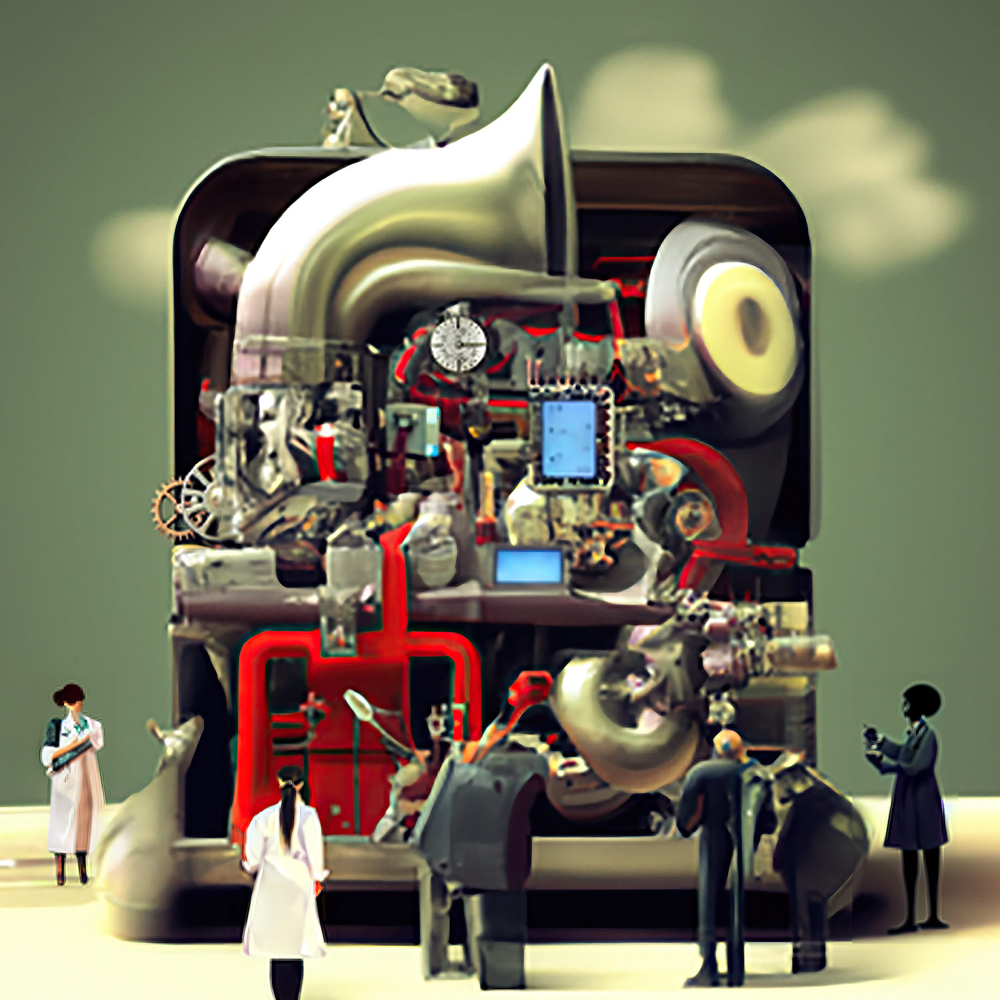

Feed for on-going research at the nexus <b>Tech x Art x Society</b>, as envisioned yearly at the Ars Electronica Festival in Linz, AT and particularly, the <b>2023 Festival encorporating <a href="https://ars.electronica.art/university/en/" target="_BLANK">the IDSA Founding Lab</a></b>, a collaborative prototype intended to identify and develop new approaches and formats that best promote the analysis and co-creation of the digital transformation on a society and global scale. I am excited about this iniative in (Upper) Austria and honored to paricipate at a critical stage in the project, allowing it to also become a template for my own and future thinking, in a loose format below.

# Masters-level Research Notes (rx Feed) on Accessible Documents Follows Below!

IDSA/Ars 2023 offer the framework for my thinking and as I look to potential applications.

<i>The <a href="https://en.wikipedia.org/wiki/Rube_Goldberg_machine" target="_BLANK">Rube Goldberg machine</a> that is digital transformation, courtesy of Ars Electronica.</i>

As part of my work on the Festival I wrote about my and the IDSA collective's ideas on the new university and the current trends in technology, for a high-end Austrian national publication (Der Standard), a regional publication (Oberösterreichische Nachrichten, OÖN) and the Ars Electronica Blog, see the following links!

<h3>Related Publications (2023 Austrian National Media)</h3>

<ul>
    <li><b><a href="https://www.derstandard.at/promotion/velcom?DcIYkpda/idsa-eine-universitaet-beginnt#!/" target="_BLANK">Der Standard</a></b></li>
    <li><b><a href="https://www.nachrichten.at/kultur/die-highlights-des-ars-electronica-festival-2023;art16,3874810" target="_BLANK">OÖN</a></b></li>
</ul>

<h3>Related Publications (2023 Ars Electronica Blog)</h3>

<ul>
    <li><b><a href="https://ars.electronica.art/aeblog/en/2023/09/12/recap-festival-2023/" target="_BLANK">Ars Electronica Blog</a></b></li>
</ul>

 

<b>Let's keep up the dialog and the society-art-tech thinking!</b>

## Ongoing rX Feed: Accessible Documents, an LLM Topic

<nav class="nav">
    <ul class="nav__list">
        <a href="/" class="nav__link">
            <i class="ri-home-5-line"></i>
            
                Home
            
        </a>

        <a href="/notes" class="nav__link active-link">
            <i class="ri-swap-line"></i>
            
                Feed
            
        </a>

        <a href="/portfolio" class="nav__link">
            <i class="ri-slideshow-2-line"></i>
            
                Portfolio
            
        </a>

        <a href="/rDai" class="nav__link">
            <i class="ri-robot-line"></i>
            
                AI
            
        </a>

        <a href="/rDse" class="nav__link">
            <i class="ri-command-line"></i>
            
                Software
            
        </a>

        <svg class="indicator" width="94" height="56" xmlns="http://www.w3.org/2000/svg">
            <ellipse cx="47" cy="28" rx="24" ry="28"/>
            <path d="M24 20C24 20 28 55.9999 48 56L0 55.9997C18 55.9998 24 20 24 20Z"/>
            <path d="M70 20C70 20 66 55.9999 46 56L94 55.9997C76 55.9998 70 20 70 20Z"/>
        </svg>
    </ul>

    
</nav>