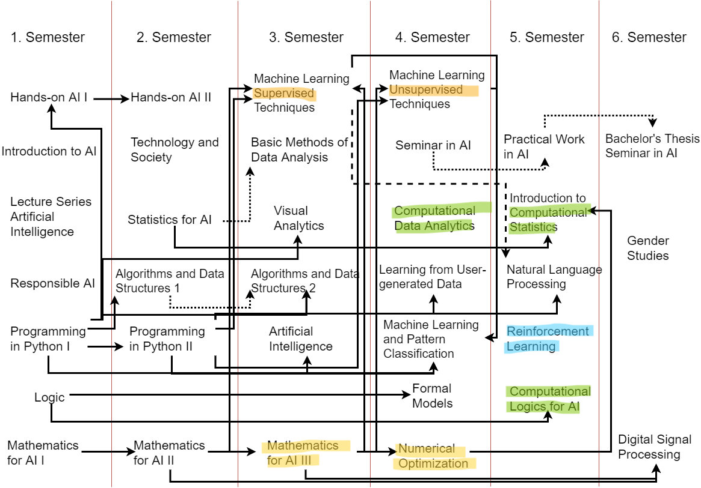

@Johannes Kepler University (JKU), Linz: Motivated mainly by the apparent connection between AI technologies and approaches like modeling and NLP/LLM (Natural Language Processing/Large Language Models) and my discipline, ECM.

What follows are a selection of topics (correlating with course work) and what I did and do and think about in those areas: these Masters level studies are on-going (target 2025), part-time, and occurring in the context of the Symbolic/Mathematical Track @JKU's AI Masters in AI: The [Curriculum is listed in English](https://studienhandbuch.jku.at/curr/933)

# NLP/LLM: Symbolic Approaches (2023 Wolfram Summer School) #

I am a participant in the 2023 Wolfram Summer School to focus some weeks in June and July on Mathematica and what they are doing on the LLM front.

Somehow intertwined with this, for me: the Nativist/Symbolic vs. Empiricist/Neural Networks debate, see [Does AI need more innate machinery?](https://www.youtube.com/watch?v=vdWPQ6iAkT4&themeRefresh=1)

My main reason for WSS was a turn to further university level math and the realization that I want a standard tool to do some of the work. I have planned for the upcoming two semesters to complete all the math from the bachelor's level AI course (marked orange in the following dependency graph visualization of the course content) together with some options out of interest (green and blue, preparatory for a deep learning reinforcement approach), as I still aim to work through the Master's course on time too.



The options I marked orange I have completed but definitely would have benefitted from doing the math first (to level 3). But in general the AI content and projects discussed here related to the AI Master's course, here that curriculum for completeness (without dependencies, but with ECTS: this one is official JKU documentation).


The goal is to complete this course in 2024 (most likely Fall), in coordination with <a href="/rDse">training in Software Engineering</a>.

# Knowledge Representation and Reasoning (2023 Project) #

Prolog (Programming in Logic) implements First Order Logic, allowing evaluation and checking. Resolution strategy is Back Tracking and Depth First, so logical programming is to a degree sequential as well, but not the way programming laguages usually work. In this way it is similar to SMT, see below.

This is an example where the stopping criterion is needed for a recursive call, for instance:

```
lastElement([E],E). % (1)
lastElement([K|R],E) :- lastElement(R,E). % (2)
```

In any case a program like the above is built up, involving facts (1, the %-sign makes a line comment) and rules (2), making for a knowledge base that can the be queried or used to proove certain statements, also encoded in prolog. The tool used was SWI Prolog. The above code snippet also shows the typical use of recursion to encode iteration.

In a project team of three, I tackled a solver for the game [Ruzzle](https://www.maginteractive.com/games/ruzzle/) (a bit like scrabble) with possible uses as a challenger AI or general solving tool. ([Github has the code](https://github.com/buchasia/prolog-ruzzle), and there's [slides](https://docs.google.com/presentation/d/18AH9J0t4yj24fl6Qlm01qGRyB6TRpj3i9aj9wGxRCzc/) to get an overview over the project too, presented at Johannes Kepler University on April 25th, 2023.)

# Model Checking (2022 Project) #

[The full project is on GitHub](https://github.com/heseltime/modelchecking_project), but the principles can be summed up in a paragraph: Satisfiability Modulo Theories (SMT) is a growing area of automated deduction with many important applications, especially system verification. The idea is to test satisfiability of a problem formula against a model. Here's an example: a C-program is the model, some bug encoded into an formula is to be checked. If we get a satisfiable result, that is bad, because that means the bug is possible against this particular C-program. So what you are usually after in a verification task is actually an unsat(isfiable) result. 

Here's a logic encoding of one of De Morgan's laws: $$ {\displaystyle {\overline {a\land b}}\equiv {\overline {a}}\lor {\overline {b}}} $$

```
(declare-fun a () Bool)
(declare-fun b () Bool)
(assert (not (= (not (and a b)) (or (not a)(not b)))))
(check-sat)
```

Result:

```unsat```

The unsat result means that the negated (!) proposition (De Morgan's law) is not satisfiable: it is true.

The concrete application was a numerical pad implementing a locking system (think something like a safe), coded up with C, and the task was to check for bugs. The final approach chosen by me and a project team of another person was to encode eight separate SMT LIB (SMT-standard language) files to run with Z3, Microsoft's SMT solver. This allowed us to rule out certain buggy behaviors to help locate the actual possible bug in the C program.

<nav class="nav">
    <ul class="nav__list">
        <a href="/" class="nav__link">
            <i class="ri-home-5-line"></i>
            <span class="nav__name">
                Home
            </span>
        </a>

        <a href="/notes" class="nav__link">
            <i class="ri-swap-line"></i>
            <span class="nav__name">
                Feed
            </span>
        </a>

        <a href="/portfolio" class="nav__link">
            <i class="ri-slideshow-2-line"></i>
            <span class="nav__name">
                Portfolio
            </span>
        </a>

        <a href="/rDai" class="nav__link active-link">
            <i class="ri-robot-line"></i>
            <span class="nav__name">
                AI
            </span>
        </a>

        <a href="/rDse" class="nav__link">
            <i class="ri-command-line"></i>
            <span class="nav__name">
                Software
            </span>
        </a>

        <svg class="indicator" width="94" height="56" xmlns="http://www.w3.org/2000/svg">
            <ellipse cx="47" cy="28" rx="24" ry="28"/>
            <path d="M24 20C24 20 28 55.9999 48 56L0 55.9997C18 55.9998 24 20 24 20Z"/>
            <path d="M70 20C70 20 66 55.9999 46 56L94 55.9997C76 55.9998 70 20 70 20Z"/>
        </svg>
    </ul>

    <script src="{{ site.baseurl }}/assets-liquid-nav/js/main.js"></script>
</nav>