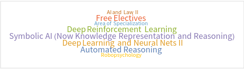

@Johannes Kepler University (JKU), Linz: Motivated mainly by the apparent connection between AI technologies and approaches like modeling and NLP/LLM (Natural Language Processing/Large Language Models) and my discipline, ECM.

What follows are a selection of topics (correlating with course work) and what I did and do and think about in those areas: these Masters level studies are on-going (target December 2024), now full-time, and occurring in the context of the Symbolic/Mathematical Track @JKU's AI Masters in AI. The most up-to-date [curriculum is listed in English](https://studienhandbuch.jku.at/curr/933) and I also wrote a [concept document](/assets/pdf/AI-SE-Symbolic-Computation-Concept.pdf) for a potential Symbolic Computation direction of these studies post-Masters here in Linz, where however LLMs and a topic dear to my heart are taking center-stage for now.

# Taking Symbolic on the Road (with [Wolfram](/wolfram)!)

<div id="symbolic-conclusion">Apart from my thesis, practical work, final exam and <a href="studies-overview">core coursework</a> (see next sections below), my AI degree in Linz involves the symbolic track components I talk about above, essentially <a href="/wolfram#computer-algebra">Computer Algebra</a> and <a href="/wolfram#automated-reasoning">Automated Reasoning</a>, both situated at <a href="https://risc.jku.at/">RISC</a>: since I am now working for Wolfram during my Masters and in the foreseeable future, I am making an effort to basically pool that work and this part of my studies: the tool (also used in Linz and at RISC), Wolfram Language, is the same, after all.

The remaining sections in this page deal with all other areas of my degree including other parts of the Symbolic track in Linz, already completed and outlined towards the end of the page.
</div>

# How to Wrap a Technical Masters Degree in Austria (at Johannes Kepler University!)

## Thesis Committee Planning

As my thesis approaches a writing-stage, I start to think about the tetris-like putting together of my thesis committee, following this guideline ([online in full (EN)](https://www.jku.at/en/degree-programs/types-of-degree-programs/masters-degree-programs/ma-artificial-intelligence/program-details/)).

> As part of the oral examination, the student will be asked to create a 3-member examination committee consisting of a committee head (member 1) and two additional members (members 2 and 3). This first committee member may not be a thesis supervisor and will preside over the oral defense. The second committee member will conduct an examination in the subject area of “Machine Learning and Perception”. The third committee member will conduct an examination in regard to the selected elective track. The thesis supervisor should also be a member of the committee. Whereas two committee members may be from the same institute, all of the committee members should not be from the same institute.

Is this task [AI/Symbolically solvable](#planning-overview)? A neural network could do it, we can be sure of that.

The ca. one-hour long exam remains for me to do, not the AI, and is about my Master's thesis, with a grade provided by member 1 in the above. Members 2 and 3 cover the required and elective coursework (according to a track, Symbolic in my case). Because I have two supervisors and it seems at least one of them (conceivably both) need to be part of the examination, I see how these slots fill up and decide subject areas in terms of the examiner for me: my supervisors come from the machine learning and the knowledge processing institutes respectively, where machine learning constitutes the core, required coursework and knowledge processing is taken to be part of the symbolic track (where I actually would have liked a cross-over to [Wolfram Language and RISC topics](/wolfram), but cannot cover these in this view - except maybe if there is no need to task all supervisors to the examination table!) so it looks like this is where I am headed, to exit my degree (in style) eventually. 

Mysterious member No 1 remains to be chosen! I wonder if this one might be offered by the Insitute of Integrated Study, see below details on the thesis' genesis.

## Studies Overview (in the 2019 Curriculum View)

<div id="studies-overview">But where am I right now in my studies and what is the timelined target?</div>

So the matter is complicated by a slight difference between the 2019 and the current 2021 curriculum (it is 2024 now and there is a delay between the given years and the years studied by: I am studying by the 2021 curriculum, I believe (!), but started by the 2019 curriculum - will need to check the details with the studies admin) but ok, let's not get weighed down here: by the 2019 curriculum and according to my original idea for this studies, subject to some slight shifting of coursework according to interest or lack thereof (sorry, looking at you, Computer vision), here are some nice Wolfram Language word clouds with the credit-weighted course titles, listed by semester.

### Prerequisite Studies

Please don't ask why I do things in complicated ways! During my [SE Bachelor's](/rDse) I enrolled in university coursework from the AI curriculum, both Bachelor's and Master's level, and then formally entered into the Masters on the basis of my college Bachelor's - requiring some preliminary coursework from the AI Bachelor's.

#### Pre I (Bachelor's AI content in parallel to SE Bachelor's)

Please don't ask why I do things in complicated ways!

* ML (Machine Learning) Supervised Techniques

I already started on some Master's level coursework too here, Model Checking, some Computer Vision (lecture requirement), Basic Methods of Data Analysis (from the Bachelor's actually), AI in Medicine (short course at the Medical Faculty in Linz).

#### Pre II (Bachelor's AI content in parallel to SE Bachelor's)

* ML Unsupervised Techniques
* Programming in Python II
* Math for AI II

### Semester I/Winter (2023/24)

Curricular ideal (here's a magical German term for you: "Idealtypischer Studienverlauf" ... ideal-typical (?) course (trajectory) of studies):


Model Checking was already done in Pre I, note on **Computer Algebra**: replaced by _Planning and Reasoning in AI_ in the 2021 curriculum. I took it, see the following word cloud, but still want to try and integrate Computer Algebra with my Masters as well, if possible: I am already in touch with the studies admin about this now.

So, the Jack-actual (Computer Vision will be done in Semester III):


### Semester II/Summer (2024 - **NOW**)

The upcoming semester, let's see if I can follow the ideal.



Actually, I already know I am doing my Practical Work Component this semester, so that already breaks with the ideal ...


Also Symbolic AI (now called Knowledge Representation and Reasoning) was already completed in Pre II. **Automated Reasoning** is going to be offered as far as I know and needs to be checked with studies admin too.

### Semester III (**Target Final Semester**)/Winter (2024/2025)

Once again an ideal:


But I already completed Practical Work and Seminar at this point, and need to wrap my masters thesis (pulling from the intended Semester IV), but still need to do the Computer Vision component (technically only the exercise, the lecture was done in Pre I actually) on the other hand, so:


Automated Reasoning is listed for this semster (2019 version), but should already have been offered in the previous semester - as is the case with Computer Algebra? Let's pin that for now.

### Shadow Semester IV (Summer 2025, Overflow/Bridging Semester)

Basically only if needed for anything else than the following curricular ideal, where I already completed everything if I stay on target (then I would be doing my exam, see above, in the spring, which could be a nice timeline too): this would be a whole semester reserved for Masters Thesis (writing), Seminar and Exam. We'll see.


#### Free Elective List

12 credits to fill according to both curriculum versions below, CAN be taken from the AI Masters prerequisite Bachelor's level coursework too. (See Pre I and II above.)

* ML supervised (4.5 credits)
* ML unsupervised (4.5 credits)
* Programming in Python II (3 credits)

#### Area of Specialization (Computer and Data Science)

9 credits to fill: 

* ~~ML supervised (4.5 credits)~~
* ~~ML unsupervised (4.5 credits)~~ 

(Looks like cannot be granted because AI Masters prerequisite Bachelor's level coursework is not elgible in this category: tough bureaucracy!)

So then, I can offer:

* Statistics for AI (6 credits, not in the prerequisites)
* Basic Methods of Data Analysis (3 credits)

Oh, that's already 9! There are some other courses of interest available actually (looking at you, Semester III and Shadow Semester IV), see the [JKU AI Master's handbook](https://studienhandbuch.jku.at/curr/989) for a current list.

#### Extra-Credit

Just kind of happened:

* AI in Medicine (2 credits, JKU) - see if needed on transcript (it's there currently)
* IDSA x Ars Electronica FOUNDING LAB Summer School (4 ECTS from IDSA/ITU) - not on transcript, that is fine

Also

* Math for AI II (6 credits, just the lecture, on my Master's transcript though the exercise for 3 credits is listed in the Bachelor's transcript, technically - see Pre II)

probably not needed, along with a couple more exercises and lectures from the AI Bachelor's which will probably not be credited towards my Master's, which is only okay in a county where the higher ed price tag goes to zero.

#### Appendix: Curriculum 2019 vs 2021, Spot the Difference!


# Thesis (Seminar/Practical Work): Few-Shot/In-Context Learning vs. Finetuning of LLMs for Document Accessibility

<div id="jku-thesis-overview">

For a rounded Masters Thesis, on <b>an ECM-AI topic</b> naturally, a comparative exploration of Finetuning especially opposite <a href="https://medium.com/@myschang/cot-in-large-language-models-in-context-learning-14d73ff57b90#:~:text=In%20Context%20Learning%20of%20CoT,examples%20to%20guide%20its%20reasoning.">In-Context Learning approaches</a> is the goal, starting with a seminar on a current paper and a company-affiliated (some more news to follow) practical work, all on the topic of making PDF-documents accessible. 

Very related to the EU Context: The <a href="https://fep-fee.eu/IMG/pdf/20210629_european_accessibility_act_report_on_the_state_of_the_art_of_publishing_standards.pdf?1892/9929f3564221902d4ca19b53c0d4d9aa2118bb62">European Accessibility Act (EAA) is an EU Directive that sets binding accessibility goals to be achieved by all the member states</a>, to be implemented by 2025.

</div>

## Seminar: Language Models are Few-Shot Learners

<div id="jku-sem">

<p><b>(Masters-)Project is a Go!</b> <a href="..\assets\pdf\LtMDA-v2-1.pdf">I even managed to get some Borges in, see slides three and four in the presentation.</a></p>

<a href="..\assets\pdf\LtMDA-v2-1.pdf"></a>

<p>Delivered on December 11th, 2023, to IML (Machine Learning Insitute) at Johannes Kepler University.</p>

</div>

## Practical Work

<div id="jku-practical">

<i>TBD, e.g. a standard software component to check and transform PDFs to accessible formats in a fully automated fashion.</i>

</div>

## Thesis

<div id="jku-thesis">

<i>TBD fully, most likely a comparison with Finetuning appraches incl. use of open models like <a href="https://ai.meta.com/llama/">Llama</a>.</i>

</div>

### Further Notes

This could be a real world application too, clearly, since the basic functionality can be distributed by API with customization and standard software modules, as might be done for practical thesis work, on top: This idea also provides a clear delineation between data-oriented service (transformation to barrier free documents) and a module that would be implemented for a company in practical work, with loss of rights to such a module.

# Planning (2023 Project)

For this project, [full repo available](https://github.com/heseltime/planning_reasoning/), I was more involved in the SMT2 (Satisfiability Modulo Theories Version 2) side, something I could imagine tying into (Python) projects in the future, for validation and checking (and here planning) purposes - so I ended up exploring interfacing modalities, here the digram overview for Part 2 of the project, the SMT-part.


The actual application is the N-Queens Problem, specifically the 8x8 version, where my solution actually implements a generator code file for generic problem sizes, together with MatPlotLib visualization actually:


Part 1 is a [Limboole](https://fmv.jku.at/limboole/) implementation, see [the repo](https://github.com/heseltime/planning_reasoning/): I like Limboole because it is a JKU project, as "a simple tool for checking satisfiability respectively tautology on arbitrary structural formulas, and not just satisfiability for formulas in conjunctive normal form (CNF), like the DIMACS format, which the standard input format of SAT solvers. The tool can also be used as a translator of such structural problems into CNF." [Quoted from the JKU Insitute for Formal Models and Verification](https://fmv.jku.at/index.html)

A little more on JKU institutes actually: This concludes my Masters work in the [JKU Symbolic AI Institute](https://www.jku.at/en/institute-for-symbolic-artificial-intelligence/), where the other course was Model Checking. Work with [FAW, the institute,](https://www.jku.at/en/institute-for-application-oriented-knowledge-processing/) (Knowledge Representation and Reasoning) is also already completed, apart from the Masters Thesis which will be co-supervised by FAW (together with the [Machine Learning Institute](https://www.jku.at/en/institute-for-machine-learning/)): leaving Automated Reasoning and Computer Algebra for 2024, both located at [RISC](https://risc.jku.at/), which I hope to connect to from my work with Wolfram Language. 

<b>Taken together, this is a symbolic counterpoint to my thesis direction working in language models and applications, reflected in [my resarch (rX) feed](/notes) going forward.</b> 

More details on my work in symbolic computation and Wolfram Language on my [Wolfram page](/wolfram), touching on my consulting work for the company as well.

# Metamathematics, Mathematica, Lean (2023 Wolfram Summer School) #

<div id="wss">

I was a grad student participant in the 2023 Wolfram Summer School (WSS) three weeks in June and July 2023.

</div>

Somehow intertwined with this, for me subjectively: the Nativist/Symbolic vs. Empiricist/Neural Networks debate, see [Does AI need more innate machinery?](https://www.youtube.com/watch?v=vdWPQ6iAkT4&themeRefresh=1) (Mathematica is a symbolic computation tool.)

My main reason for WSS was a turn to further university level math and the realization that I want a standard tool to do some of the work. <a href="../assets/pdf/AI-SE-Symbolic-Computation-Concept.pdf">More on a concept for these potential studies in Linz/Hagenberg (Austria, Software Engineering and AI studies) incl. a view towards a Symbolic Computation PhD (again, writing it out as a *potential* long-term view).</a>

To connect Wolfram/Mathematica with my Masters-level courses: Computer Algebra and Automated Reasoning (see concept document, these are the core RISC courses in my study track) require/substantially benefit from Mathematica. Here, for now, is the poster output of the summer school.


The final output of the school was a <a href="https://community.wolfram.com/groups/-/m/t/2957419">community post</a> and presentation, forthcoming as a publication in the 2023 Wolfram Summer School Proceedings: I also handed in [results and further study](..\assets\pdf\expose-tree-pattern-function-native-export.pdf) for my studies in Software Engineering at Hagenberg, see the Software Engineering page about the thesis this became.

# Knowledge Representation and Reasoning (2023 Project) #

Prolog (Programming in Logic) implements First Order Logic, allowing evaluation and checking. Resolution strategy is Back Tracking and Depth First, so logical programming is to a degree sequential as well, but not the way programming laguages usually work. In this way it is similar to SMT, see below.

This is an example where the stopping criterion is needed for a recursive call, for instance:

```
lastElement([E],E). % (1)
lastElement([K|R],E) :- lastElement(R,E). % (2)
```

In any case a program like the above is built up, involving facts (1, the %-sign makes a line comment) and rules (2), making for a knowledge base that can the be queried or used to proove certain statements, also encoded in prolog. The tool used was SWI Prolog. The above code snippet also shows the typical use of recursion to encode iteration.

In a project team of three, I tackled a solver for the game [Ruzzle](https://www.maginteractive.com/games/ruzzle/) (a bit like scrabble) with possible uses as a challenger AI or general solving tool. ([Github has the code](https://github.com/buchasia/prolog-ruzzle), and there's [slides](https://docs.google.com/presentation/d/18AH9J0t4yj24fl6Qlm01qGRyB6TRpj3i9aj9wGxRCzc/) to get an overview over the project too, presented at Johannes Kepler University on April 25th, 2023.)

# Model Checking (2022 Project) #

[The full project is on GitHub](https://github.com/heseltime/modelchecking_project), but the principles can be summed up in a paragraph: Satisfiability Modulo Theories (SMT) is a growing area of automated deduction with many important applications, especially system verification. The idea is to test satisfiability of a problem formula against a model. Here's an example: a C-program is the model, some bug encoded into an formula is to be checked. If we get a satisfiable result, that is bad, because that means the bug is possible against this particular C-program. So what you are usually after in a verification task is actually an unsat(isfiable) result. 

Here's a logic encoding of one of De Morgan's laws: 

$$ {\displaystyle {\overline {a\land b}}\equiv {\overline {a}}\lor {\overline {b}}} $$

```
(declare-fun a () Bool)
(declare-fun b () Bool)
(assert (not (= (not (and a b)) (or (not a)(not b)))))
(check-sat)
```

Result:

```unsat```

The unsat result means that the negated (!) proposition (De Morgan's law) is not satisfiable: it is true.

The concrete application was a numerical pad implementing a locking system (think something like a safe), coded up with C, and the task was to check for bugs. The final approach chosen by me and a project team of another person was to encode eight separate SMT LIB (SMT-standard language) files to run with Z3, Microsoft's SMT solver. This allowed us to rule out certain buggy behaviors to help locate the actual possible bug in the C program.

<nav class="nav">
    <ul class="nav__list">
        <a href="/" class="nav__link">
            <i class="ri-home-5-line"></i>
            <span class="nav__name">
                Home
            </span>
        </a>

        <a href="/notes" class="nav__link">
            <i class="ri-swap-line"></i>
            <span class="nav__name">
                Feed
            </span>
        </a>

        <a href="/portfolio" class="nav__link">
            <i class="ri-slideshow-2-line"></i>
            <span class="nav__name">
                Portfolio
            </span>
        </a>

        <a href="/rDai" class="nav__link active-link">
            <i class="ri-robot-line"></i>
            <span class="nav__name">
                AI
            </span>
        </a>

        <a href="/rDse" class="nav__link">
            <i class="ri-command-line"></i>
            <span class="nav__name">
                Software
            </span>
        </a>

        <svg class="indicator" width="94" height="56" xmlns="http://www.w3.org/2000/svg">
            <ellipse cx="47" cy="28" rx="24" ry="28"/>
            <path d="M24 20C24 20 28 55.9999 48 56L0 55.9997C18 55.9998 24 20 24 20Z"/>
            <path d="M70 20C70 20 66 55.9999 46 56L94 55.9997C76 55.9998 70 20 70 20Z"/>
        </svg>
    </ul>

    <script src="{{ site.baseurl }}/assets-liquid-nav/js/main.js"></script>
</nav>