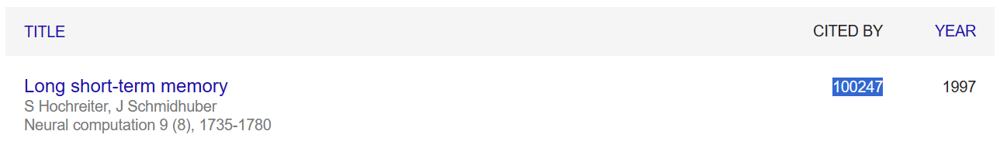

@Johannes Kepler University (JKU), Linz: Motivated mainly by the apparent connection between AI technologies and approaches like modeling and NLP/LLM (Natural Language Processing/Large Language Models) and my discipline, ECM.

<div class="toc">
    <h2>academic blog post overview</h2>
    <ul>
        <li>
            <h3>Reinforcement Learning Goes Deep</h3>
            <p>Part II Coming Soon.</p>
            
            <p><a href="#rl-1">Part I: Q-learning Algorithm Implementation for a Grid World Environment</a></p>
        </li>
        <li>
            <h3><a href="#attn"><b>Attention</b> via LSTM, the Transformer-Connection</a></h3>
            <p>LSTM's <i>Temporal</i> Attention as the way into this topic: why process all input, when only some parts are relevant? I want to end on the simplifications Transformers make, while focusing on Attention for seq2seq, i.e. Sequence-to-Sequence models. </p>
            <p>(End-of-story? <a href="https://www.nx-ai.com/">We'll see, maybe in Linz!</a>)</p>
        </li>
        <li>
            <h3><a href="#lstm">LSTM in the Linz AI Curriculum</a></h3>
            <p>Includes some WL (Wolfram Language). (Let's always include some WL.) My focus here is on LSTM for language (seq2seq and generative), but I build up from the basics and draw on the most helpful resources I could find where needed, though still following the central JKU AI course's presentation of the topic.</p>
        </li>
        <li>
            <h3>Presentation: <a href="#jku-sem">Language Models are Few-Shot Learners</a></h3>
            <p><b>Seminar-presentation/Thesis I.</b> Next up a practical component and the thesis itself.</p>
        </li>
    </ul>
    <p><i>Some <a href="#housekeeping">housekeeping notes</a> on my degree, and shorter tool-oriented posts about <a href="#wss">Wolfram Language</a>, <a href="#prolog">Prolog</a> (!), and SMT2 <a href="#smt-for-model-checking">for model checking</a> and <a href="#smt-for-planning">for planning</a> are also here, whereas <a href="/wolfram">further Wolfram Language work is documented as part of my engagement at Wolfram Research</a>.</i></p>
    <p><a href="/notes">rX Feed</a> (really, notes on how to apply this stuff) and my <a href="#jku-thesis-overview">formal thesis</a> in its different parts, interlaced with these blog posts, become part of the same project, I find: <b>I hope you have fun reading! All credit for the techniques presented goes to the authors. All errors in their presentation are mine.</b> I am happy for you to <a href="mailto:jack.heseltine@gmail.com">get in touch</a> for any comments, suggestions and any notes you have for me about the material.</p>
</div>

_These Masters level studies are on-going (target December 2024), now full-time, and occurring in the context of the Symbolic/Mathematical Track @JKU's AI Masters in AI. The most up-to-date [curriculum is listed in English](https://studienhandbuch.jku.at/curr/933) and I also wrote a [concept document](/assets/pdf/AI-SE-Symbolic-Computation-Concept.pdf) for a potential Symbolic Computation direction of these studies post-Masters here in Linz, where however LLMs and their application too are taking center-stage for now, as my Masters contribution to the Zeitgeist._

# <a name="attn"></a> Attention via LSTM, the Transformer-Connection

[Andrej Karpathy](https://karpathy.github.io/) was not the first to point out: 

> The concept of attention is the most interesting recent architectural innovation in neural networks.

_In [The Unreasonable Effectiveness of Recurrent Neural Networks](https://karpathy.github.io/2015/05/21/rnn-effectiveness/): check it out for RNN character-level language modeling on several fun datasets._

He goes on to distinguish between soft attention (he likens it to declaring a pointer in C, just it doesn't point to an address, but instead defines an entire distribution over all addresses in the entire memory) and hard attention, _where chunks of memory are attended to at a time_. This is a good image to have in mind as we move into the topic.

But we take the route though RNNs/[LSTM](#lstm), not directly via Transformers: we will get there, though.

## Xu et al. (2015): _Spatial Attention_

I already talked about this at the end of [LSTM in the Linz AI Curriculum.](#lstm) Basically: to make a classification or a prediction, I don't need to _pay attention_ to every detail involved. This makes intuitive sense. Here is how Hochreiter and Adler put it in the LSTM and Recurrent Neural Networks lecture script, which I could not find in a public place online for the moment.

> To find an appropriate caption for an image, a distinction between important and dispensable content has to be made.

The authors go on to cite Xu, specifically the attention needed for image captioning.


The attention involved in this kind of image captioning is _spatial_.

## LSTM: Gates Introduced _Temporal Attention_

Spatial attention is for images and data in more-than-1-D space, whereas temporal attention is for sequences and focuses on the elements (or the intervals) of sequences.

> Without explicitly mentioning it, we already have dealt with attention mechanisms. The gating mechanisms of LSTM memory calles have the purpose of controlling which information is used or kept and which information is ignored. Gates can decide wich information enters a memory cell, which information is kept over time, and which information can be disregarded or scaled down. **Gating is focusing on a subset of the available information, i.e. it is an attention mechanims.**

(Hochreiter and Adler Scriptum)

This is the fundamental insight here.

As an example, consider the input gate of an LSTM memory cell.

$$
\begin{align}
\boldsymbol{i}(t) &= \sigma\left(\boldsymbol{W}_{i}^{\top} \boldsymbol{x}(t)+\boldsymbol{R}_{i}^{\top} \boldsymbol{y}(t-1)\right) \\
\boldsymbol{z}(t) &= g\left(\boldsymbol{W}_{z}^{\top} \boldsymbol{x}(t)+\boldsymbol{R}_{z}^{\top} \boldsymbol{y}(t-1)\right) \\
\boldsymbol{c}(t) &= \boldsymbol{f}(t) \odot \boldsymbol{c}(t-1)+\boldsymbol{i}(t) \odot \boldsymbol{z}(t) \\
\end{align}
$$

The input activation vector is of the form $$ \boldsymbol{i}(t) \in \left(0, 1\right)^I $$. This means that its multiplication with the cell input activation in the final equation above controls which, and to which degree, elements of $$ \boldsymbol{z}(t) $$ are used to update the cell state. Therefore the elements of $$ \boldsymbol{i}(t) $$ can be interpreted as the attention $$ \boldsymbol{z}(t) $$ receives.

In the language that has developed around attention mechanisms in deep learning, the inner product between the kth column of $$ \boldsymbol{W}_i $$ and the input vector as the _attention score_ $$ e_k \in \mathbb{R} $$:

$$

e_k = \sum_{l=1}^{d} w_{lk} \cdot x_l + (w^*_{k})^\top \cdot x = \|w^*_{k}\| \cdot \|x\| \cdot \cos(\angle(w^*_{k}, x))

$$

The magnitude of $$ e_k $$ depends on the product of the norms of $$ w^*_{k} $$ and $$ x $$ while the sign depends on the angle. As the magnitude grows and $$ w^*_{k} $$ and $$ x $$ in a similar direction, the attention will be high because $$ \sigma(e_k) \approx 1 $$. If the vectors point in opposite directions, attention will be $$ \approx 0 $$. 

> This way, every column of the weight matrix $$ \boldsymbol{W}_i $$ can learn to selectively choose input vectors with certain traits. Every entry of the input gate [...] is of the form $$ \boldsymbol{i_k} \in \left(0, 1\right) $$. This can be considered as _soft attention_ to entry $$ z_k $$, since it can also choose to let through half of the information. Would the gate be either zero or one, i.e. $$ \boldsymbol{i_k} \in \left\{0, 1\right\} $$, teh gate $$ i_k $$ is paying _hard attention_ to the entry $$ z_k $$.

## Attention in seq2seq (Sequence-to-Sequence Models)

The basic RNN seq2seq model consists of two networks, the encoder and the decoder, where the encoder reads a sentence of length $$ \left( \boldsymbol{x}(t) \right)^T_{t=1} $$ of length $$ T $$ and produces a fixed-dimensional vector representation $$ v $$ of the whole sequence.


(From Hochreiter and Adler)

Typically $$ v $$ is the last state $$ h_T $$ of the encoder network but can also be the last cell state $$ c_T $$. This approach was introduced by both

* [Cho et al. (2014)](https://arxiv.org/abs/1406.1078): using GRU.
* [Sutskever et al. (2014)](https://arxiv.org/abs/1409.3215): in a similar but modified version that uses LSTM.

Regardless of state vector being copied and RNN-Model used, the problem with the approach is that, no matter how complex the input sequence, it needs to be encoded as a whole, to one vector $$ v $$, rather than being broken down to only the relevant parts. The attention in this model is realized by the encoder RNN.

### Additive Attention

An early attention mechanism was introduced by [Bahdanau et al. (2014)](https://arxiv.org/abs/1409.0473), which enhances the encoder-decoder model by enabling it to focus on various parts of the input sequence sequentially. This mechanism is integrated with an alignment process. From the Abstract, highlighting how this ties into their translation task:

> The models proposed recently for neural machine translation often belong to a family of encoder-decoders and consists of an encoder that encodes a source sentence into a fixed-length vector from which a decoder generates a translation. In this paper, we conjecture that the use of a fixed-length vector is a bottleneck in improving the performance of this basic encoder-decoder architecture, and propose to extend this by allowing a model to automatically (soft-)search for parts of a source sentence that are relevant to predicting a target word, without having to form these parts as a hard segment explicitly. With this new approach, we achieve a translation performance comparable to the existing state-of-the-art phrase-based system on the task of English-to-French translation. Furthermore, qualitative analysis reveals that the (soft-)alignments found by the model agree well with our intuition.

The encoder uses a **bidirectional RNN (BiRNN)** to process the input sequence both in the forward and backward directions, generating forward and backward hidden states. These states are combined at each time step to provide a comprehensive view of the input sequence.

The decoder RNN generates the **output at each time step based on its current hidden state, the previous output, and a context vector**. This context vector is computed using the attention mechanism, which employs an **attention vector to create a weighted sum of the encoder's hidden states**.

The **attention score**, which is crucial for computing the attention vector, is determined by a **feedforward neural network using the previous hidden state of the decoder and the hidden state from the encoder**. This score function is an example of _additive attention_ due to the summation operation inside the tanh function.

> The attention score $$ e_j(i) $$ is in principle an alignment score that determines how well the inputs around position $$ j $$ and the output at position $$ i $$ match. **The score function is a feedforward neural network** with parameters $$ \boldsymbol{W} $$ and $$ \boldsymbol{U} $$ and inputs $$ \boldsymbol{s}(i − 1) $$ and $$ \boldsymbol{h}(j) $$. 

(Hochreiter and Adler, emphasis added)

This feedforward network is jointly trained with the other RNNs and is:

$$

e_j(i) = \mathbf{v}^\top \tanh(\mathbf{W} s(i - 1) + \mathbf{U}h(j))

$$

Where $$ \mathbf{W} \in \mathbb{R}^{n \times n}, \mathbf{U} \in \mathbb{R}^{n \times 2n}, \mathbf{v} \in \mathbb{R}^{n} $$ are the parameters. The dimension $$ n $$ is the size of the hidden vector in the BiRNN. The sum inside the tanh is where the name of the attention method comes from, as in "additive" attention.

After calculating the attention scores, a softmax function is applied to derive the attention vector, which is then used to compute the context vector as a weighted sum of the encoder's hidden states. 

$$

a(i) = \text{softmax}(e(i))
c(i) = \mathbf{H}a(i) = \sum_{t=1}^{T} h(t)a_t(i)

$$

Here $$ \boldsymbol{H} = \left( \boldsymbol{h}(1), ..., \boldsymbol{h}(T) \right) $$ is a matrix with the hidden units as columns, so $$ \boldsymbol{f}_con $$ is the matrix-vector product of attention vector and hidden units.

The Bahdanau et al. model illustrated graphically:


At the attention, level, what is happening? This intensity map ("sample alignments") from the paper illustrates the translation task being treated. Every column is an attention vector.


### Multiplicative and Local Attention

[Luong et al. (2015)](https://arxiv.org/abs/1508.04025) modify the approach. Instead of a bidrectional GRU encoder, multiplicative attention uses a unidrectional stacked LSTM encoder, and in addition to the additive attention (_concat_ in this paper), _dot_ and _general_ score functions are introduced. Taken together, _multiplicative attention_ becomes:

$$

e_t(i) = \mathbf{h}(t)^\top \mathbf{s}(i) \quad \text{(dot)} 

$$

$$

e_t(i) = \mathbf{h}(t)^\top \mathbf{W} \mathbf{s}(i) \quad \text{(general)}

$$

$$

e_t(i) = \mathbf{v}^\top \tanh(\mathbf{W} [\mathbf{s}(i); \mathbf{h}(t)]) \quad \text{(concat)}

$$

Attention vector (_alignment vector_ in this paper):

$$

a(i) = \text{softmax}(e(i))

$$

> Multiplicative attention is simpler than additive attention. For short input sequences the performance of multiplicative attention is similar to that of additive attention, but for longer sequences additive attention has the advantage.

(Hochreiter and Adler)

Luong et al. (2015) also introduce propose _local_ attention (the idea is to not attend to all hidden units, but only to a subset of hidden units inside a window) in addition to _global_ attention.

### Self-Attention

I defer to Hochreiter and Adler for introducing Self-attention via the LSTM network, proposed in [Cheng et al. (2016)](https://arxiv.org/abs/1601.06733), after citing from the relevant abstract first:

> In this paper we address the question of how to render sequence-level networks better at handling structured input. We propose a machine reading simulator which processes text incrementally from left to right and performs shallow reasoning with memory and attention. The reader extends the Long Short-Term Memory architecture with a memory network in place of a single memory cell. This enables adaptive memory usage during recurrence with neural attention, offering a way to weakly induce relations among tokens. The system is initially designed to process a single sequence but we also demonstrate how to integrate it with an encoder-decoder architecture. Experiments on language modeling, sentiment analysis, and natural language inference show that our model matches or outperforms the state of the art.

(Cheng et al. (2016))

> So far attention was based on the decoder having access to hidden states of the encoder. Cheng et al. (2016) introduced intra-attention or self-attention where an LSTM network has access to its own past cell states or hidden states. The idea is that all information about the previous states and inputs should be encoded in $$ h(t) $$. Therefore all relations between states should be induced, which is achieved by intra-attention or self-attention. Toward this end, Cheng et al. (2016) augment the LSTM architecture with a memory for the cell states c and the hidden states (LSTM outputs) $$ h $$. The memory just stores all past cell state vectors c in a matrix $$ C = \left(c(1), . . . , c(t − 1) \right) $$ and all past hidden state vectors $$ h $$ in a matrix $$ \boldsymbol{H}(t − 1) = \left(h(1), . . . , h(t − 1)\right) $$. Now the LSTM has direct access to its own past states, where the access mechanism is self-attention.

(Hochreiter and Adler)

The formulas for calculating $$ \boldsymbol{e}(t) $$ and attention vector $$ \boldsymbol{a}(t) $$ over all previous timesteps $$ i = 1, ..., t - 1 $$ are:

$$

e_i(t) = \mathbf{v}^\top \tanh(\mathbf{W}_{hh} \mathbf{h}(i) + \mathbf{W}_{xx} \mathbf{x}(t) + \mathbf{W}_{\tilde{h}\tilde{h}} \tilde{\mathbf{h}}(t - 1))

$$

$$

a(t) = \text{softmax}(e(t))

$$

$$

\mathbf{\tilde{h}} = \mathbf{H}(t-1) \mathbf{a}(t-1)

$$

Here ...

$$

\mathbf{H}(t-1) = \left( \mathbf{h}(1), ..., \mathbf{h}(t-1) \right)

$$

... is the matrix of hidden states up to $$ t - 1 $$. 

The attention vector is also applied to all past cell states $$ \boldsymbol{C} = \left( \boldsymbol{c}(1), ..., \boldsymbol{c}(t - 1) \right) $$:

$$

\boldsymbol{\tilde{c}(t)} = \boldsymbol{C}(t-1)\boldsymbol{a}(t-1)

$$

Once again, to sum up in terms of the formulas for the forward pass:

$$

\boldsymbol{i}(t) = \sigma \left( \boldsymbol{W}_i^{\top} \boldsymbol{x}(t) + \boldsymbol{R}_i^{\top} \boldsymbol{\tilde{h}}(t) \right)

$$

$$

\boldsymbol{o}(t) = \sigma \left( \boldsymbol{W}_o^{\top} \boldsymbol{x}(t) + \boldsymbol{R}_o^{\top} \boldsymbol{\tilde{h}}(t) \right)

$$

$$

\boldsymbol{z}(t) = \sigma \left( \boldsymbol{W}_z^{\top} \boldsymbol{x}(t) + \boldsymbol{R}_z^{\top} \boldsymbol{\tilde{h}}(t) \right)

$$

$$

\boldsymbol{c}(t) = \boldsymbol{\tilde{c}}(t) + \boldsymbol{i}(t) \odot \boldsymbol{z}(t)
 
$$

Note: $$ \odot $$ signifies the Hademard-product.

$$

\boldsymbol{h}(t) = \boldsymbol{o}(t) \odot tanh(\boldsymbol{c}(t))

$$

LSTM with self-attention is called _Long Short-Term Memory-Network (LSTMN)_.

Self-attention can be applied at the level of sentences, as in (Lin et al. (2017))[https://arxiv.org/abs/1703.03130]. From the abstract:

> This paper proposes a new model for extracting an interpretable sentence embedding by introducing self-attention. Instead of using a vector, we use a 2-D matrix to represent the embedding, with each row of the matrix attending on a different part of the sentence.

The authors use a bidirectional LSTM encoder as in Bahdenau et al. (2014), discussed earlier.


### Key-Value Attention 

The final form of attention to be highlighted, in order of development, is _Key-Value Attention_. So far we have performed attention like so: The calcuation of an attention score $$ \boldsymbol{e} $$, the transformation of the score to an attention vector $$ \boldsymbol{a} $$ and then the we calculated the context vector (_glimpse_) $$ \boldsymbol{c} $$. 

But there is a better way: Daniluk et al. (2017), frustrated by the short attention spans they were finding (Frustratingly Short Attention Spans in Neural Language Modeling) analzyed that the hidden states are oversubscribed in the sense that they have multiple roles to fulfill.

> Neural language models predict the next token using a latent representation of the immediate token history. Recently, various methods for augmenting neural language models with an attention mechanism over a differentiable memory have been proposed. For predicting the next token, these models query information from a memory of the recent history which can facilitate learning mid- and long-range dependencies. However, conventional attention mechanisms used in memory-augmented neural language models produce a single output vector per time step. This vector is used both for predicting the next token as well as for the key and value of a differentiable memory of a token history.

They

* encode the distribution for predicting the next token
* serve as a key to compute the attention vector
* encode relevant content to inform future predictions

and are therefore open to breaking down into roles, directly inside the hidden states. The central idea is to separate the hidden vector into a _Key_ part $$ \boldsymbol{k} $$ and a value part $$ \boldsymbol{v} $$, both size $$ d $$.

$$

\mathbf{h}_t = \begin{pmatrix} \mathbf{k}_t^\top \\ \mathbf{v}_t^\top \end{pmatrix} \in \mathbb{R}^{2d}

$$

(I am following the notation in Hochreiter and Adler closely here: ) For the score at timestep $$ t $$, additive attention is applied to the keys in a sliding window of size $$ L $$ up to the curren time step $$ \boldsymbol{K}(t - 1) = \boldsymbol{k}(t - L), ..., \boldsymbol{k}(t - 1) $$ and the current key $$ \boldsymbol{k}(t) $$.

$$

\mathbf{e}_t = \mathbf{w}^\top \tanh(\mathbf{W}_K \mathbf{K} + [\mathbf{W}_k \mathbf{k}_t] \mathbf{1}^\top) \in \mathbb{R}^L

$$

$$ \boldsymbol{W}_K $$, $$ \boldsymbol{W}_k \in \boldsymbol{R}^{dxd} $$, $$ \boldsymbol{w} \in \boldsybol{R}^d $$ and $$ \boldsymbol{1} \in \boldsymbol{R} $$.   

Once again, the attention vector is obtained by applying softmax and the context vector is calculated by multiplying the attention vector by the values in $$ \boldsymbol{V}(t - 1) $$:

$$

\boldsymbol{a}(t) = softmax(\boldsymbol{e}(t))

$$

$$

\boldsymbol{c}(t) = \boldsymbol{V}(t - 1) \boldsymbol{a}(t)

$$

Daniluk et al. (2017) provide the following helpful schematic (top row):


We see the difference between previous attention mechanisms (a) and key-value attention (b). The context vector is denoted with r here.

## Transformers

Transformer networks, or _Transformers_ for short, **are an easy thing in this blog post now, because the concepts have been introduced** - I think this is the point the related lecture (and exercise at JKU) is making too.

> The NeurIPS 2017 publication [Attention Is All you Need](https://arxiv.org/abs/1706.03762) from Google Brain introduced the Transformer which is based on End-to-end Memory Network

From the abstract from Attention Is All You Need:

> The dominant sequence transduction models are based on complex recurrent or convolutional neural networks in an encoder-decoder configuration. The best performing models also connect the encoder and decoder through an attention mechanism. We propose a new simple network architecture, the Transformer, based solely on attention mechanisms, dispensing with recurrence and convolutions entirely. Experiments on two machine translation tasks show these models to be superior in quality while being more parallelizable and requiring significantly less time to train.

They go on to cite succesful BLEU scores, which demonstrates the architecture's capacity. The most famous items from this paper are however the diagrams, I would say: First in overview.


Then in detail: where we a drawing out math operations as bubbles and lines basically, but yes, it works.


### Transformers in Wolfram Language (WL)

I almost forgot! Of course, you can [deploy Transformers in WL](https://www.wolfram.com/language/12/neural-network-framework/use-transformer-neural-nets.html?product=mathematica) and load models like GPT and BERT super quickly too.

In fact, this is a great tool to take apart the models and learn about them that way, after you load and run them.

For

```

NetTake[bert, "embedding"]

```

![NetTake[bert, "embedding"] in Mathematica Notebook](image-44.png)

> The transformer architecture then processes the vectors using 12 structurally identical self-attention blocks stacked in a chain. The key part of these blocks is the attention module, constituted of 12 parallel self-attention transformations, a.k.a. "attention heads".

([WL documentation/example](https://www.wolfram.com/language/12/neural-network-framework/use-transformer-neural-nets.html?product=mathematica))

Here is the difference between Bert and GPT via the Mathematica Notebook interface. 

> GTP has a similar architecture as BERT. Its main difference is that it uses a causal self-attention, instead of a plain self-attention architecture. This can be seen by the use of the "Causal" mask in the AttentionLayer.

(Ibid.)

```
NetExtract[bert, {"encoder", 1, 1, "attention", 1, "attention"}]
```

![NetExtract[bert, {"encoder", 1, 1, "attention", 1, "attention"}] in Mathematica Notebook](image-45.png)


```
NetExtract[gpt, {"decoder", 1, 1, "attention", 1, "attention"}]
```

![NetExtract[gpt, {"decoder", 1, 1, "attention", 1, "attention"}]](image-46.png)

Leaving the tool-question at this for the moment, I'll say that looking at these kinds of models' architecture will form a signficant component in my [Masters Thesis (and Practical Component)](#jku-thesis-overview), write-up coming up soon (once I have the execution). 

Thanks for reading!


# <a name="rl-1"></a> Reinforcement Learning Goes Deep (Part I): Q-learning Algorithm Implementation for a Grid World Environment

Repository on [GitHub](https://github.com/heseltime/reinforcement-learning-ubern): for this **Part I** to a look at Deep Learning for Reinforcement Learning (RL), i.e. Deep Reinforcement Learning, I want to review some RL basics, largely following the well-tested [Sutton and Barto text](https://web.stanford.edu/class/psych209/Readings/SuttonBartoIPRLBook2ndEd.pdf), ending on a note about [planning](#smt-for-planning) vs learning and a focus on the foundational Bellman equation.


_Excited to have been part of the [uBern Winter School](https://www.dsl.unibe.ch/training/winter_schools/) on Reinforcement Learning this February, to catch up on some basics._

## Test Project: Environment, Policy, and the OpenAI Gym

The provided code is an implementation of the Q-learning algorithm in the [OpenAI Gym](https://github.com/openai/gym) tailored for a specific grid world environment. This environment includes an agent, an enemy, and a target, all located within a grid. The goal of the Q-learning algorithm is to learn an optimal policy for the agent to navigate the grid to reach the target while avoiding the enemy.

[](https://github.com/heseltime/reinforcement-learning-ubern/blob/main/README.md)

### Key Components of the Code

* **Initialization and Episode Loop**: The run_episode_gwenv function initializes the episode by resetting the environment, which provides the initial state. The episode then runs for a maximum number of steps defined by _maxsteps, simulating the agent's interactions within the environment.
* **State Representation**: States are represented by the grid positions of the agent, enemy, and target. This requires a multidimensional Q-table to accommodate the multi-entity state space.
* **Epsilon-Greedy Policy**: During training, an epsilon-greedy policy is employed for action selection. This involves choosing a random action with a probability of epsilon (exploration) and the best-known action with a probability of 1 - epsilon (exploitation).
* **Q-Table Update**: The Q-value for the taken action is updated using the observed reward and the maximum Q-value of the next state, adjusted by the learning rate lr and discounted by the factor discount. This update mechanism is guided by the Bellman equation.
* **Parameters**:
    * lr/alpha: Learning rate, controlling the Q-value update magnitude. (In the group at uBern my group focused on varying this parameter, hence the multiple versions at the end of [**Control.ipynb**](https://github.com/heseltime/reinforcement-learning-ubern/blob/main/Control.ipynb))
    * discount/gamma: Discount factor, influencing the weight of future rewards.
    * epsilon: Exploration-exploitation trade-off parameter.
* **Optimal Policy Execution**: If the optimal flag is true, the algorithm solely relies on exploitation by selecting the action with the highest Q-value for the current state, bypassing exploration.
* **Return Values**: Returns the updated Q-table and the reward from the final step of the episode, facilitating the evaluation of the learned policy.

## Q-learning Algorithm for Grid World Environment

This Python function implements the Q-learning algorithm for a grid world environment where an agent navigates to reach a target while avoiding an enemy. It demonstrates key reinforcement learning concepts such as state representation, action selection, and Q-value updates.

```python
def run_episode_gwenv(env, Q, lr, discount, epsilon=0.1, render=False, _maxsteps=20, optimal=False):
    observation, _ = env.reset()
    done = False
    nsteps = 0

    for x in range(_maxsteps):
        nsteps += 1
        if done:
            break

        if render:
            env.render()

        curr_state = observation
        ax = curr_state['agent'][0]
        ay = curr_state['agent'][1]
        ex = curr_state['enemy'][0]
        ey = curr_state['enemy'][1]
        tx = curr_state['target'][0]
        ty = curr_state['target'][1]

        if not optimal:
            randnum = np.random.rand(1)
            if randnum < epsilon:
                action = env.action_space.sample()
            else:
                action = np.argmax(Q[ax, ay, ex, ey, tx, ty,:])

            observation, reward, done, _, info = env.step(action)
            ax_next = observation['agent'][0]
            ay_next = observation['agent'][1]
            ex_next = observation['enemy'][0]
            ey_next = observation['enemy'][1]
            tx_next = observation['target'][0]
            ty_next = observation['target'][1]

            Q[ax, ay, ex, ey, tx, ty, action] += lr * \
                (reward + discount * np.max(Q[ax_next, ay_next, ex_next, ey_next, tx_next, ty_next, :]) - Q[ax, ay, ex, ey, tx, ty, action])
        else:
            action = np.argmax(Q[ax, ay, ex, ey, tx, ty,:])
            observation, reward, done, _, info = env.step(action)

    return Q, reward
```

The implementation assumes the environment provides specific functionalities:

* `env.reset()`: Resets the environment to an initial state.
* `env.render()`: Renders the current state of the environment.
* `env.action_space.sample()`: Samples a **random** action from the action space.
* `env.step(action)`: Executes an action in the environment, returning the new state, reward, and other information.

Q-learning is a model-free reinforcement learning algorithm that aims to learn the value of an action in a particular state without requiring a model of the environment. It does so by estimating Q-values, which represent the expected utility of taking a given action in a given state and following the optimal policy thereafter. 

The key features of Q-learning include:

* **Model-free**: It does not require knowledge of the environment's dynamics (i.e., the transition probabilities and rewards). This makes Q-learning highly versatile and applicable to a wide range of problems where the environment is unknown or difficult to model accurately.
* **Off-policy**: Q-learning learns the optimal policy independently of the agent's actions. This means it can learn from exploratory actions and even from observing other agents.
* **Q-value Updates**: The core of the algorithm involves updating the Q-values using the Bellman equation as an iterative update rule. This update minimizes the difference between the left-hand side (the current Q-value estimate) and the right-hand side (the observed reward plus the discounted maximum future Q-value).

## Planning vs Learning

Planning, in the context of reinforcement learning, involves generating or improving a policy for decision-making by using a model of the environment. Unlike Q-learning, planning requires a model that predicts the outcomes of actions (transitions and rewards). Planning can be used to simulate experiences and improve policies without direct interaction with the environment. Key aspects of planning include:

* **Model-based**: Planning requires a model of the environment to predict the outcomes of actions. This model can be learned from experience or provided a priori.
* **Simulated Experience**: Planning algorithms use the model to simulate experiences, which are then used to improve the policy. This process can significantly reduce the need for actual interactions with the environment, which might be costly or dangerous.
* **Value Iteration and Policy Iteration**: Common planning algorithms include value iteration and policy iteration, both of which rely on the Bellman equation to iteratively improve value estimates or policies.

## The Bellman Equation

The Bellman equation is central to both Q-learning and planning, serving as the mathematical foundation that describes the relationship between the value of a state (or state-action pair) and the values of its successor states. In its essence, the Bellman equation provides a recursive decomposition of value functions:

**Bellman Equation for Value Functions**:

$$
V(s) = \max_a \left[ R(s, a) + \gamma \sum_{s'} P(s' \mid s, a) V(s') \right]
$$

In Python code with a description of the parameters above as well:

```
def update_value_function(V, R, P, gamma, states, actions):
    """
    Update the value function for each state using the Bellman equation.
    
    Parameters:
    - V: dict, value function, where keys are states and values are values of states
    - R: function, reward function R(s, a) returning immediate reward
    - P: function, transition probabilities P(s'|s, a) returning dict of {state: probability}
    - gamma: float, discount factor
    - states: list, all possible states
    - actions: list, all possible actions
    
    Returns:
    - Updated value function V
    """
    V_updated = V.copy()
    for s in states:
        V_updated[s] = max([R(s, a) + gamma * sum(P(s, a)[s_prime] * V[s_prime] for s_prime in states) for a in actions])
    return V_updated

```

**Bellman Equation for Q-Values**

$$
Q(s, a) = R(s, a) + \gamma \sum_{s'} P(s' \mid s, a) \max_{a'} Q(s', a')
$$

In Python code, with the parameters again:

```
def update_q_values(Q, R, P, gamma, states, actions):
    """
    Update the Q-values for each state-action pair using the Bellman equation.
    
    Parameters:
    - Q: dict, Q-values, where keys are (state, action) pairs and values are Q-values
    - R: function, reward function R(s, a) returning immediate reward
    - P: function, transition probabilities P(s'|s, a) returning dict of {state: probability}
    - gamma: float, discount factor
    - states: list, all possible states
    - actions: list, all possible actions
    
    Returns:
    - Updated Q-values Q
    """
    Q_updated = Q.copy()
    for s in states:
        for a in actions:
            Q_updated[(s, a)] = R(s, a) + gamma * sum(P(s, a)[s_prime] * max(Q[(s_prime, a_prime)] for a_prime in actions) for s_prime in states)
    return Q_updated
```

These equations are at the heart of many reinforcement learning algorithms, providing a recursive relationship that is used to iteratively update the values or Q-values towards their optimal values.

## Connecting to Planning Symbolic AI

We already discussed planning vs learning, and now I would like to connect to Planning in Symbolic AI. See also my [SMT Project in Planning (N-Queens Problem)](#smt-for-planning).

Planning in symbolic artificial intelligence, including techniques such as Satisfiability Modulation Theories (SMT), offers a different approach compared to the statistical or model-free methods seen in Q-learning. SMT, an extension of Boolean satisfiability (SAT), involves finding solutions to logical formulas over one or more theories (e.g., arithmetic, bit-vectors, arrays). These capabilities make SMT particularly well-suited for planning in deterministic, discrete environments where problems can be expressed as logical constraints. A classic example of such a problem is the N Queens puzzle, which can be solved using SMT by formulating it as a set of constraints.

### Advantages and Considerations

* **Deterministic Solutions**: SMT provides a deterministic way to solve the N Queens problem, giving a definitive answer about the existence of a solution and providing the solution if it exists.
* **Scalability**: While SMT solvers are powerful, the complexity of solving such problems can grow exponentially with the size of N, making it challenging for very large N.
* **General Applicability**: The approach used for the N Queens problem can be adapted to solve a wide range of other constraint-based problems in various domains, including scheduling, configuration problems, and more.

In contrast to the statistical learning approaches in reinforcement learning, SMT and other symbolic AI planning methods offer precise, logic-based solutions to well-defined problems. This makes them particularly useful in scenarios where the problem space is discrete and can be fully expressed through logical constraints.

## Connecting to Deep Learning

Next up: Part II, combining Deep Learning and Reinforcement Learning for Deep Reinforcement Learning. (Coming soon.) 

The deep learning idea experimentally explored in [AdvancedRL.ipynb](https://github.com/heseltime/reinforcement-learning-ubern/blob/main/AdvancedRL.ipynb) revolves around using a neural network as a function approximator for the Q-learning algorithm, a method known as Deep Q-Learning (DQN).

# LSTM in the Linz AI Curriculum

It's a core course for the Master's, treating a core AI datastructure so to speak, maybe as central as Convolutional Neural Networks, and at least framing the perspective on Transformers (where there is no separate course). After all, JKU's [Sepp Hochreiter](https://en.wikipedia.org/wiki/Sepp_Hochreiter) [invented LSTM (Long-Short-Term Memory)](https://www.bioinf.jku.at/publications/older/2604.pdf), but to go there, you need to [start from RNNs (Recurrent Neural Networks)](https://colah.github.io/posts/2015-08-Understanding-LSTMs/) first.

> This chain-like nature reveals that recurrent neural networks are intimately related to sequences and lists. They’re the natural architecture of neural network to use for such data.

<div id="lstm">(Chris Olah, "Understanding LSTM Networks" posted on August 27, 2015 and accessed Febrary 17, 2024)</div>

RNN-Feats? Read [The Unreasonable Effectiveness of Recurrent Neural Networks](https://karpathy.github.io/2015/05/21/rnn-effectiveness/) by Andrej Karpathy, maybe not so unreasonable in light of the quote from Chris Olah.

## Quick Test: Wolfram Language LSTM Handling

Let's try something to begin, though, before jumping into more background on RNNs generally, and LSTM specifically, right up to the 2024 [xLSTM Story](https://www.heise.de/news/NXAI-Sepp-Hochreiter-will-europaeische-Antwort-auf-OpenAI-erschaffen-9618232.html) (DE-world currently).

I know Python is the default in many AI curricula nowadays, but tools like Wolfram Language (WL) can be more effective because they are more high level. It really depends on what you want to emphasize: are you interested in implementation details, or do you just want to work with the networks?

Let's try this **Input:**

```
(*recurrent layer acting on variable-length sequences of 2-vectors*)
lstm = NetInitialize@
  LongShortTermMemoryLayer[2, "Input" -> {"Varying", 2}]
(*Evaluate the layer on a batch of variable-length sequencesEvaluate the layer on a batch of variable-length sequences*)
seq1 = \{\{0.1, 0.4\}, \{-0.2, 0.7\}\};
seq2 = \{\{0.2, -0.3\}, \{0.1, 0.8\}, \{-1.3, -0.6\}\};
result = lstm[{seq1, seq2}]
```

**Output:**

```
\{\{\{-0.0620258, 0.0420743\}, \{-0.0738596, 
   0.0826808\}\}, \{\{0.0240281, -0.00213933\}, \{-0.0691157, 
   0.0852326\}, \{0.190297, -0.117645\}\}\}
```

For something just a bit more complicated, let's produce a number for each sequence: this is what it would look like to chain up the layers in WL.

**Input:**

```
net = NetInitialize@
  NetChain[{EmbeddingLayer[3], LongShortTermMemoryLayer[1], 
    SequenceLastLayer[]}, "Input" -> NetEncoder["Characters"]]
```

**Output** [after the jump, in a repo I made for the demo notebook.](https://github.com/heseltime/WLForRNNs/blob/main/lstm-tests.nb) If you don't want to download the notebook and boot up Mathematica, the output looks like this, however.


What follows is a small taxonomy of RNNs, centering on LSTM, _with the formulas!_

## RNN Architectures

### Jordan


For the Jordan network, which is a type of recurrent neural network (RNN) that connects the output to the input of the network for the next time step, the equations are slightly different from those of LSTM-like networks we will look at in a moment.

$$
\begin{align}
\boldsymbol{h}(t) &= \sigma\left(\boldsymbol{W}_{h}^{\top} \boldsymbol{x}(t) + \boldsymbol{R}_{h}^{\top} \boldsymbol{y}(t-1)\right) \\
\boldsymbol{y}(t) &= \phi\left(\boldsymbol{W}_{y}^{\top} \boldsymbol{h}(t)\right)
\end{align}
$$

The point here is: _weight sharing_ is emplyoed, that is, the same weights are used across time steps. **_R_** is the Recurrent Weight Matrix here.

### Elman

The _"simple recurrent neural network"_ as you sometimes see it called: Internal hidden activations are remembered, but hidden units loop only to themselves, not neighbors or any other units:

$$
\begin{align}
\boldsymbol{h}(t) &= \sigma\left(\boldsymbol{W}_{h}^{\top} \boldsymbol{x}(t) + \boldsymbol{a}(t-1)\right) \\
\boldsymbol{y}(t) &= \phi\left(\boldsymbol{V}^{\top} \boldsymbol{a}(t)\right)
\end{align}
$$

### Fully Recurrent Network

Do you spot what is moving in the formulas, as complexity and thereby expressivity is added?

$$
\begin{align}
\boldsymbol{h}(t) &= \sigma\left(\boldsymbol{W}^{\top} \boldsymbol{x}(t) + \boldsymbol{R}^{\top} \boldsymbol{h}(t-1)\right) \\
\boldsymbol{y}(t) &= \phi\left(\boldsymbol{V}^{\top} \boldsymbol{h}(t)\right)
\end{align}
$$

We arrive at the Fully RNN with recurrent hidden layers that are fully connected, so all the hidden units are able to store information, i.e. from previous inputs. There is a time lag to these connections, therefore.

### Autoregressive-Moving-Average (ARMA), Non-linear Autoregressive Exogenous Models (NARX) and Time-Delay Neural Networks

Let's discuss the ideas on a high level.


The Autoregressive Moving Average (ARMA) model is a popular statistical model used for time series forecasting. It combines two components: Autoregressive (AR) and Moving Average (MA). The AR part involves using the dependency between an observation and a number of lagged observations. The MA part involves modeling the error term as a linear combination of error terms occurring contemporaneously and at various times in the past.

The ARMA model can be denoted as ARMA(p, q), where $$p$$ is the order of the autoregressive part, and $$q$$ is the order of the moving average part. The general form of the ARMA model is given by the following equation:

$$
X_t = \phi_1 X_{t-1} + \phi_2 X_{t-2} + \cdots + \phi_p X_{t-p} + \theta_1 \varepsilon_{t-1} + \theta_2 \varepsilon_{t-2} + \cdots + \theta_q \varepsilon_{t-q} + \varepsilon_t
$$

Where:

- $$X_t$$ is the time series at time $$t$$,
- $$\phi_1, \phi_2, \ldots, \phi_p$$ are the coefficients of the autoregressive terms,
- $$\theta_1, \theta_2, \ldots, \theta_q$$ are the coefficients of the moving average terms,
- $$\varepsilon_t$$ is white noise at time $$t$$.


The Nonlinear AutoRegressive with eXogenous inputs (NARX) model is a type of recurrent dynamic network that is particularly useful for modeling and predicting time series data influenced by past values of the target series and past values of external (exogenous) inputs. It is a powerful tool for capturing complex nonlinear relationships in time series data.

The Nonlinear AutoRegressive with eXogenous inputs (NARX) model can be represented as follows:

$$
y(t) = f\left(y(t-1), y(t-2), \ldots, y(t-d_y), u(t-1), u(t-2), \ldots, u(t-d_u)\right) + \varepsilon(t)
$$

Where:

- $$y(t)$$ is the output at time $$t$$,
- $$u(t)$$ is the exogenous input at time $$t$$,
- $$d_y$$ and $$d_u$$ are the delays (or memory) for the output and input respectively,
- $$f$$ represents a nonlinear function, often realized by a neural network,
- $$\varepsilon(t)$$ is the error term at time $$t$$.

Finally, Time Delay Neural Networks (TDNNs) are a specialized form of neural networks designed to recognize patterns across sequential data, effectively capturing temporal relationships. TDNNs introduce a mechanism to handle time series or sequence data by incorporating time-delayed connections in their architecture. This allows the network to consider input not just from the current time step but also from several previous time steps, thus leveraging the temporal context of the data.

The operation of a neuron in a TDNN can be mathematically represented as follows:

$$
y(t) = f\left( \sum_{i=0}^{N} w_i x(t-i) + b \right)
$$

where:
- $$y(t)$$ is the output of the neuron at time $$t$$,
- $$x(t-i)$$ represents the input at time $$t-i$$,
- $$w_i$$ are the weights associated with inputs at different time delays,
- $$b$$ is the bias term,
- $$f$$ is the activation function,
- $$N$$ is the number of time steps considered (the window size).

So much for further background on the architectural levels. Let's let the latter models especially serve as contextual notes, the goal always being to express connections across time steps. So far so good!

## Learning and the Vanishing Gradient Problem

### Backpropagation Through Time (BPTT)

#### How BPTT Works:

1. **Unfolding the Network:** The RNN is "unrolled" for each time step in the input sequence, transforming it into an equivalent feedforward network where each layer corresponds to a time step.

2. **Forward Pass:** Inputs are fed sequentially, and activations are computed across the unrolled network, moving forward through time.

3. **Backward Pass:** The loss is calculated at the final output, and gradients are backpropagated through the network, taking into account the impact of weights across all time steps.

4. **Gradient Accumulation:** Gradients for each time step are accumulated since the same weights are applied at every step.

5. **Weight Update:** The weights are updated using the accumulated gradients, employing optimization algorithms like SGD, Adam, or RMSprop.

#### Challenges with BPTT:

**- Vanishing and Exploding Gradients:** These issues can significantly hinder learning, especially for long sequences. LSTM and GRU units are designed to mitigate these problems.

**- Computational Intensity:** Processing long sequences in their entirety for each update can be computationally demanding and memory-intensive.

**- Truncated BPTT:** This approach limits the unrolled network to a fixed number of steps to reduce computational requirements, though it may restrict the model's ability to learn from longer sequences.

BPTT enables RNNs to effectively leverage sequence data, making it crucial for applications in fields like natural language processing and time series analysis. We will pass by some important initialization, regularization, and other approaches and methods for the purposes of this summary post.

#### The Formulas

[I'll refer to Dive Into Deep Learning's section on this topic.](https://d2l.ai/chapter_recurrent-neural-networks/bptt.html)

### Truncated BPTT

Dive Into Deep Learning (ibid) has the idea:

>  ... an approximation of the true gradient, simply by terminating the sum at $$\partial h_{t-\tau}/\partial w_\textrm{h}$$
. In practice this works quite well. It is what is commonly referred to as truncated backpropgation through time (Jaeger, 2002).

[Here is a reference tutorial paper I really like by Herbert Jaeger](https://www.ai.rug.nl/minds/uploads/ESNTutorialRev.pdf), covering the method in some more detail and also presenting the material covered in this post from different angles.

### Real-time Recurrent Learning (RTRL)

RTRL is an online learning algorithm, which means it updates the weights of the neural network in real-time as each input is processed, rather than waiting for a full pass through the dataset (as in batch learning). This characteristic makes RTRL suitable for applications where the model needs to adapt continuously to incoming data, such as in control systems, real-time prediction tasks, or any scenario where the data is streaming or too large to process in batches.

The key feature of RTRL is its ability to compute the gradient of the loss function with respect to the weights of the network at each time step, using the information available up to that point. This is achieved by maintaining a full Jacobian matrix that tracks how the output of each unit in the network affects each other unit. However, this comes with a significant computational cost because the size of the Jacobian matrix grows quadratically with the number of units in the network, making RTRL computationally expensive for large networks.

Despite its computational demands, RTRL has been foundational in the development of algorithms for training RNNs, and it has inspired the creation of more efficient algorithms that approximate its computations in a more computationally feasible manner, such as Backpropagation Through Time (BPTT) and its various optimized forms.

RTRL is particularly valued in scenarios where it's crucial to update the model weights as new data arrives, without the luxury of processing the data in large batches. However, due to its computational cost, practical applications often use alternative methods that strike a balance between real-time updating and computational feasibility.

### Summary of the asymptotic complexities

**- BPTT (Backpropagation Through Time)**
  **- Asymptotic Complexity:** `O(T * C)` where `T` is the length of the input sequence and `C` represents the complexity of computing the gradients at a single timestep (including both forward and backward passes). The complexity scales linearly with the length of the input sequence but requires significant memory for long sequences.

**- RTRL (Real-Time Recurrent Learning)**
  **- Asymptotic Complexity:** `O(n^4)` for a network with `n` units. This high computational complexity arises from the need to update a full Jacobian matrix tracking the dependencies of all units on each other at every timestep. It makes RTRL impractical for large networks despite its real-time learning capability.

**- TBPTT (Truncated Backpropagation Through Time)**
  **- Asymptotic Complexity:** `O(k * C)` where `k` is the truncation length (the number of timesteps for which the network is unfolded) and `C` is similar to that in BPTT. TBPTT provides a more manageable and predictable computational cost, especially for long sequences, offering a practical compromise between computational efficiency and the benefits of temporal learning.


## LSTM Solves the Vanishing Gradient Problem

### Vanilla LSTM

Let's dive into the formulas following the architectures approach from before.

$$
\begin{align}
\boldsymbol{i}(t) &= \sigma\left(\boldsymbol{W}_{i}^{\top} \boldsymbol{x}(t)+\boldsymbol{R}_{i}^{\top} \boldsymbol{y}(t-1)\right) \\
\boldsymbol{o}(t) &= \sigma\left(\boldsymbol{W}_{o}^{\top} \boldsymbol{x}(t)+\boldsymbol{R}_{o}^{\top} \boldsymbol{y}(t-1)\right) \\
\boldsymbol{f}(t) &= \sigma\left(\boldsymbol{W}_{f}^{\top} \boldsymbol{x}(t)+\boldsymbol{R}_{f}^{\top} \boldsymbol{y}(t-1)\right)  \\
\boldsymbol{z}(t) &= g\left(\boldsymbol{W}_{z}^{\top} \boldsymbol{x}(t)+\boldsymbol{R}_{z}^{\top} \boldsymbol{y}(t-1)\right) \\
\boldsymbol{c}(t) &= \boldsymbol{f}(t) \odot \boldsymbol{c}(t-1)+\boldsymbol{i}(t) \odot \boldsymbol{z}(t) \\
\boldsymbol{y}(t) &= \boldsymbol{o}(t) \odot h(\boldsymbol{c}(t))
\end{align}
$$

The Vanilla LSTM, distinguished by its three gates and a memory state, is a staple variant in the realm of Long Short-Term Memory networks. It stands out for its ability to selectively preserve or ignore information, making it adept at managing memory cells amid potential distractions and noise. This selective filtering results in a highly non-linear dynamic that equips the LSTM to execute complex functions effectively.

Here's an overview of the Vanilla LSTM's operation, highlighting its components and their respective functions:

- **Sensory Inputs (`x(t)`):** Incoming data at each time step, transformed into cell input activations (`z(t)`) through a non-linear function (`g(·)`), typically the hyperbolic tangent (`tanh`).
- **Input Gate (`i(t)`):** Utilizes a sigmoid function to filter (`z(t)`), allowing only relevant information to pass through based on the current context.
- **Forget Gate (`f(t)`):** Also employing a sigmoid function, it determines the proportion of the previous cell state (`c(t−1)`) to retain or discard, enabling the cell to forget irrelevant past information. This is added to the original design propsed by Hochreiter and Schmidhuber 1997 (Hochreiter 1991) - along with some other changes:


- **Cell State Update:** The new cell state (`c(t)`) is formed by an element-wise addition of the product of the input gate and cell input activations (`i(t)⊙z(t)`) with the product of the forget gate and the previous cell state (`f(t)⊙c(t−1)`), effectively updating the memory with relevant new information while discarding the old.
- **Output Gate (`o(t)`):** The final step involves squashing the memory cell's contents into a numerical range via a cell activation function (`h(·)`) and then filtering this through an output gate. This process yields the final memory cell state activation (`y(t)`), ready for the next computational step or to serve as the output.

This structured approach allows the Vanilla LSTM to adeptly navigate through time series data, learning from long-term dependencies and making it a powerful tool for a wide range of sequential data processing tasks.


Figure from K. Greff, R.K. Srivastava, J. Koutnik, B.R. Steunebrink, J. Schmidhuber. IEEE Transactions on Neural Networks and Learning Systems, Vol 28(10), pp. 2222–2232. Institute of Electrical and Electronics Engineers (IEEE). 2017.

### Focused, Lightweight LSTM and Gated Recurrent Unit (GRU): Traditional LSTM Variants

**Focused LSTM**: No forget gate and fewer parameters than Vanilla LSTM.

**Lightweight LSTM**: The Focused LSTM without output gates. (Has Markov properties*.)

(*The Markov property is a fundamental concept in the theory of stochastic processes. It refers to the memoryless property of a process, where the future state depends only on the current state and not on the sequence of events that preceded it. There are several types.)

**Gated Recurrent Unit (GRU)**

> A slightly more dramatic variation on the LSTM is the Gated Recurrent Unit, or GRU, introduced by [Cho, et al. (2014)](https://arxiv.org/pdf/1406.1078v3.pdf). It combines the forget and input gates into a single “update gate.” It also merges the cell state and hidden state, and makes some other changes. The resulting model is simpler than standard LSTM models, and has been growing increasingly popular.

From Chris Olah’s [Understanding LSTM Networks](https://colah.github.io/posts/2015-08-Understanding-LSTMs/): great diagrams there.

Previous state is replaced to the degree that a new update is made, in a simpler architecture. 

This follows:

$$

\boldsymbol{c}(t)=(\mathbf{1}-\boldsymbol{i}(t)) \odot \boldsymbol{c}(t-1)+\boldsymbol{i}(t) \odot \boldsymbol{z}(t)

$$

### "Getting" LSTM

Regardless of architecture, and since a lot has been written to explain LSTMs from the ground up, I would like to clear up the blocks you might face if you are similar to me, as you try and understand the approach.

- The weights $$ W_{\{i,o,f,z\}} $$ are **matrices**, for the input data to each of the gates
- The recurrent weights $$ R_{\{i,o,f,z\}} $$ are **also just learnable matrices**, it really is all very similar to a regular neural net once you unroll the thing formally
- you end up with two pathways through the unit and overall structures, basically one for short-range and one for long-range dependencies: short-term corresponds to inner states of the cells.
- the first stage in the LSTM cell determines what percentage of the long-term memory is remembered (forget gate)
- the part that of the LSTM cell that determines how to update the long-term memory is called the input gate
- opposite this last point, the output gate: updates the short-term memory
- separating the paths for long- and short-term memories, LSTMs avoid the vanishing/exploding gradient problem: that means we can unroll them more times to accommodate longer sequences of input data

I can really recommend [StatQuest if you want a video](https://www.youtube.com/watch?v=YCzL96nL7j0), but you have to like the StatQuest presentation style ("Bam").

### Tricks of the Trade

See **Ticker Steps**, **Negative Gate Biases**, **Scaled Activation Functions**, etc. in [The Sorcerer’s Apprentice Guide to Training LSTMs](https://www.niklasschmidinger.com/posts/2020-09-09-lstm-tricks/) by Niklas Schmidinger.

Dropout on the feedforward structure of LSTM will disturb the function of memory cells for sufficiently long sequences, due to exponential decay. This hinders learning. 

> Another LSTM dropout method that is not limited in this sense is called **_zoneout_** (Krueger et al., 2017), whose basic idea is to drop out the updates to the memory cell instead of clearing its entire content. In this manner, dependencies spanning over a dropout event can still be learned as long as the dropped-out update did not carry the crucial piece of information.

Hochreiter and Adler, LSTM and Recurrent Neural Nets (lecture notes from the course at IML, JKU Linz, Winter Semeseter 2021)

## LSTM, Transformers, Hybrid xLSTM?

For another day: [JKU in the headlines, precisely on topic](https://www.jku.at/en/news-events/news/detail/news/ai-made-in-europe-spitzenforscher-sepp-hochreiter-und-sein-xlstm-erhalten-unternehmerische-verstaerkung-fuer-europaeisches-large-language-model/), but what's the idea? I think this is not yet out of the bag but will be soon, providing an opportunity for another post here. At the core, this is about LSTM vs Transfomers however and sounds like something hybrid.

> The transformer computations increase quadratically according to the text length. By contrast, xLSTM calculations increase in a linear manner only, along with the text length, thereby using less processing power during operation. As complex tasks require more text for both the task description and the solution, this is a great advantage. Fortunately, xLSTM can, for example, facilitate industrial applications, especially if transformer models are too slow. Similar to transformer models, xLSTM has a phonetic memory. The algorithm is, however, equipped with an additional component that results in a closer resemblance to human verbal working memory, making the xLSTM algorithm much more powerful.

I am excited to catch wind of the story directly as it unfolds at JKU.

## LSTM-Applications

The algorithm has a history, naturally:



(According to Google Scholar, LSTM has been quoted more than 100000 Times.)

So the following can only be a selection: I am **mostly interested in language**, you will notice.

### Sequence to sequence (seq2seq)

**Sequence to sequence (seq2seq)** learning with Long Short-Term Memory (LSTM) networks is a method in deep learning where one sequence (input sequence) is used to generate another sequence (output sequence). This approach is commonly used in tasks such as machine translation, where an input sequence in one language is converted into an output sequence in another language. Here's a high-level overview of how it works:
* **Encoder** LSTM: The first part of a seq2seq model is the encoder. The encoder processes the input sequence and compresses the information into a context vector (also known as the encoder's final hidden state). This vector aims to encapsulate the information for all input elements in order to help the decoder make accurate predictions. The encoder reads the input sequence, element by element, and updates its internal state at each step.
* This (overall) **Input Representation** is how individual elements (e.g., words in a sentence) in the input sequence are represented. In the context of natural language processing, words are often converted into vectors using word embeddings. These word embeddings serve as the input representation for each word in the sequence. Examples of word embeddings (methods) are _latent semantic analysis_ (Dumais, 2004) and neural word embedding (Bengio et al., 2003), based on a next-word predictiont task. _word2vec_ is a related toolkit (Mikolov et al., 2013) that makes use of continuous Bag-of-Words (predict target word from context words, in any order) and the inverse, continuous skipgram (predict context words from target word). In all cases semantic properites of words are encoded by vectors.
* **Context Vector**: This is the final state of the encoder LSTM, which is supposed to capture the essence of the input sequence. It's used as the initial hidden state of the decoder LSTM.
* **Decoder** LSTM: The decoder is trained to predict the next element in the sequence, given the previous element and the context vector. Initially, the decoder is provided with a start-of-sequence token as its first input along with the context vector. At each step, the decoder updates its internal state and predicts the next element in the output sequence.
* **Training** Process: During training, the decoder's predictions are compared to the actual output sequence, and the error is backpropagated through both the decoder and encoder to update their weights. Typically, a technique called **Teacher Forcing** is used where the actual output element (rather than the predicted one) is provided to the decoder in the next time step.
* **Inference**: At inference time, the encoder processes the input sequence and generates a context vector. The decoder then uses this vector to generate the output sequence. Since the actual output sequence is not available during inference, the decoder's previous prediction is used as the next input.
* **Attention** Mechanism: Modern seq2seq models often incorporate an attention mechanism, which allows the decoder to focus on different parts of the input sequence at each step of the output generation. This is particularly useful for long sequences, where the context vector alone may not be sufficient to capture all the necessary information. Seq2seq models with LSTMs have been a cornerstone in natural language processing before the advent of transformer models, offering robustness in handling sequences of varying lengths and the ability to capture long-term dependencies. (See the last section of this post, and the upcoming post on Attention.)

Sutskever et al. (2014) successfully employed the above technique - here the abstract for _Sequence to Sequence Learning with Neural Networks_:

> Deep Neural Networks (DNNs) are powerful models that have achieved excellent performance on difficult learning tasks. Although DNNs work well whenever large labeled training sets are available, they cannot be used to map sequences to sequences. In this paper, we present a general end-to-end approach to sequence learning that makes minimal assumptions on the sequence structure. Our method uses a multilayered Long Short-Term Memory (LSTM) to map the input sequence to a vector of a fixed dimensionality, and then another deep LSTM to decode the target sequence from the vector. Our main result is that on an English to French translation task from the WMT’14 dataset, the translations produced by the LSTM achieve a BLEU score of 34.8 on the entire test set, where the LSTM’s BLEU score was penalized on out-of-vocabulary words. Additionally, the LSTM did not have difficulty on long sentences. For comparison, a phrase-based SMT system achieves a BLEU score of 33.3 on the same dataset. When we used the LSTM to rerank the 1000 hypotheses produced by the aforementioned SMT system, its BLEU score increases to 36.5, which is close to the previous best result on this task. The LSTM also learned sensible phrase and sentence representations that are sensitive to word order and are relatively invariant to the active and the passive voice. Finally, we found that reversing the order of the words in all source sentences (but not target sentences) improved the LSTM’s performance markedly, because doing so introduced many short term dependencies between the source and the target sentence which made the optimization problem easier.

I want to look at the scoring methods a bit more closely in a moment.

But first, there are two seq2seq approaches by the way, with one-to-one correspondence:

$$

\boldsymbol{p} ( \boldsymbol{y}((t)) | \boldsymbol{x}(\mathbf{1}), ..., \boldsymbol{x}(\mathbf{t}), \boldsymbol{y}(\boldsymbol{1}), ..., \boldsymbol{y}(\mathbf{t - 1}) )

$$

And without:

$$

\boldsymbol{p} ( \boldsymbol{y}((t)) | \boldsymbol{x}(\mathbf{1}), ..., \boldsymbol{x}(\mathbf{T}), \boldsymbol{y}(\boldsymbol{1}), ..., \boldsymbol{y}(\mathbf{t - 1}) )

$$

The encoder-decoder step is needed for the latter.

#### BLEU


The abstract:

> Human evaluations of machine translation are extensive but expensive. Human evaluations can take months to finish and involve human labor that can not be reused. We propose a method of automatic machine translation evaluation that is quick,
inexpensive, and language-independent, that correlates highly with human evaluation, and that has little marginal cost per
run. We present this method as an automated understudy to skilled human judges which substitutes for them when there is
need for quick or frequent evaluations.

BLEU therefore stands for _Bilingual Evaluation Understudy_.

In practice, according to Hochreiter and Adler: "it can [...] be hard to use if judging between systems which are truly better than humans" - because judgement at the single-sentence level is not a given. It consists of two parts, a brevity penalty _B_ amd the geometric mean of n-gram precisions, "where an n-gram is a contiguous sequence of _n_ items from a given sample of text or speech and the geometric mean is computed for all values of _n_ between 1 and the upper limit _N_:

$$

\text{BLEU} = B \cdot \exp\left(\sum_{n=1}^{N} \log c^{(n)}\right)

$$

$$ c^{(n)} $$ is the number of n-grams in the candidate translation that occur in any of the reference translations, divided by the total nmber of n-grams in the candidate translation: The metric is a form of _precision_ - this implements what the authors call "translation closeness" and relies on a corpus of good quality human reference translations. From the paper:

> The primary programming task for a BLEU implementor is to compare n-grams of the candidate with the n-grams of the reference translation and count the number of matches. These matches are positionindependent. The more the matches, the better the
candidate translation is.

### Generating Sequences


Abstract from Graves, 2013, a landmark paper in demonstrating the capabilities of LSTMs in sequence generation tasks:

> This paper shows how Long Short-term Memory recurrent neural networks can be used to generate complex sequences with long-range structure, simply by predicting one data point at a time. The approach is demonstrated for text (where the data are discrete) and online handwriting (where the data are real-valued). It is then extended to handwriting synthesis by allowing the network to condition its predictions on a text sequence. The resulting system is able to generate highly realistic cursive handwriting in a wide variety of styles.

This paper predicts **at the character level** (by the way, the Linz curriculum implements this in the companion exercise to the lecture - you would have to reach out if you want to take a look at this, but you can find the relevant code approaches pretty easily) and is based on corpora like the Hitter Prize, revolving around the compression for the frist 100 million bytes of the complete English Wikipedia data. Graves splits the first 96 million bytes evenly into sequences of 100 bytes and uses them to train the network. The remaining 4 M bytes are used for validation. 

The LSTM was tasked to predict a single byte at a time.

From Hochreiter and Adler:

> To make it possible for the network to capture the long-term dependencies of the data, the units and the output gate activations were only reset every 100 sequences and no shuffling was conducted during training. The network was therefore able to access information from up to 10K characters in the past when making predictions.

The architecture is digrammed as follows.


While the network does invent (feasible looking) words, it also learns punctuation, e.g. being able to open and close quotation marks correctly and so on, clearly indicating language modeling memory. It is easy to see how the principle at work here might have informed **word-level** approaches in the years to come, even when switching to Transformers.

Two concreate generative examples using LSTM:

* Karpathy: LaTeX and Linux kernel code generation in blog post, [The Unreasobal Effectiveness of RNNs](https://karpathy.github.io/2015/05/21/rnn-effectiveness/)
* Radford et al., 2017.: I really like this work. It breaks down a review represented by an Amazon-review-trained next character prediction LSTM to a single unit performing sentiment analysis, the prediction this work is intersted in. From the Abstract:
    > We explore the properties of byte-level recurrent language models. When given sufficient amounts of capacity, training data, and compute time, the representations learned by these models include disentangled features corresponding to high-level concepts. Specifically, we find a single unit which performs sentiment analysis.

    

    The sentiment analysis was done on other review sources like IMDB and Yelp and essentially were good/bad classification.

    


### LSTM Success Stories: Image Captioning, Learning to Learn, Rainfall-Runoff and Talking Heads

In **image captioning**, Karapathy and Fei-Fei (2015), present a model that generates natural language descriptions of images and their regions. The goal is to learn the inter-modal correspondences.


Given an image, the system should come up with a short description of what is depicted in the image, in natural language: the authors split the task into two stages: First, a CNN which was pretrained on [ImageNet](https://www.image-net.org/) parses the image content. The output hidden representation is passed to the bidirectional, fully recurrent RNN which generates a sentence that describes the image content. [Kiros et al.](https://arxiv.org/abs/1411.2539) followed a similar approach in 2014 but using LSTM as recurrent network.

> Inspired by recent advances in multimodal learning and machine translation, we introduce an encoder-decoder pipeline that learns (a): a multimodal joint embedding space with images and text and (b): a novel language model for decoding distributed representations from our space. Our pipeline effectively unifies joint image-text embedding models with multimodal neural language models. We introduce the structure-content neural language model that disentangles the structure of a sentence to its content, conditioned on representations produced by the encoder. The encoder allows one to rank images and sentences while the decoder can generate novel descriptions from scratch. Using LSTM to encode sentences, we match the state-of-the-art performance on Flickr8K and Flickr30K without using object detections.

**Learning to learn using LSTM**: Meta-learning, i.e. designing systems which discover new learning algorithms. 

> In principle, such systems consist of two components, the supervisory system and the subordinate system. The supervisory system trains the subordinate system to learn to solve certain machine learning tasks. Hochreiter et al. (2001) pointed out that an RNN can be used as a meta-learning system. Since an RNN is Turing equivalent, it can model both the supervisory and the subordinate system. In Hochreiter et al. (2001) it was even shown that these two systems do not have to be distinguished. Only the current best solution must be stored by the RNN.

This sounds like something that would be worth exploring in the future: **#future-blog-post.**

**Rainfall-Runoff**: This is an example of LSTM modelling of the environment. The goal for rainfall-runoff modelling is to systematically describe how rainfall leads river discharge. So one is working with waterflow properties basd on the inputs of temperature and precipitation, mainly. (Hydrological prediction is important for utilizing water properly and/or protecting against its adverse impact in the case of floods.)

**Talking Heads**: Fan et al. (2015) showed how to use _bidirectional_ LSTM (BLSTM) to generate video of talking heads,in the field of computer vision and graphics, particularly focusing on generating or animating realistic talking heads from images or videos. The general aim of such research is to create realistic animations of human heads and faces that can mimic speech and expressions, often using deep learning or other machine learning techniques.

In the context of computer vision and graphics, "talking heads" research usually involves the following (is therefore no easy task):

1. **Facial Feature Detection:** Identifying and tracking key facial features, such as the mouth, eyes, and eyebrows, which are crucial for realistic animation.

2. **Speech Synchronization:** Aligning facial movements with audio to ensure that the mouth movements match the spoken words, enhancing the realism of the talking head.

3. **Expression Generation:** Creating a range of expressions that can be applied to the talking head, allowing it to convey emotions and reactions in addition to speech.

4. **Model Training:** Utilizing datasets of human faces and speech to train models that can generate and animate talking heads. This might involve deep learning models that can learn from a large amount of data to produce high-quality animations.

Overview for the Fan et al. BLSTM Training system:


The results have already entered mainstream consciousness, creating, among other things, a new level of distrust for video media of, well, talking heads, whomever they belong to - speaking at the cultural level. See here: very notable was the Synthesizing-Obama application in [Suwajanakorn et al.](https://grail.cs.washington.edu/projects/AudioToObama/siggraph17_obama.pdf)


In the preceeding, some _further LSTM variants_ than the traditional ones like Vanilla, Focused and Lightweight have already beendiscussed. Let's review those towards the end of this post, to understand where LSTM implementations were at the last couple of years.


## (Further) LSTM Variants

The LSTM networks have seen numerous variations and adaptations to enhance their performance in various tasks. While the base-LSTM was designed to tackle the vanishing gradient problem and to better capture long-term dependencies in sequence data compared to standard RNNs, these actually have been developed to address specific challenges and applications.

### Peephole Connections

In a standard LSTM unit, the gate mechanisms (input, output, and forget gates) make decisions based on the current input and the previous hidden state. Peephole connections are a modification where these gates can also look at the cell state directly. This allows the gates to have more context, enabling the LSTM to learn more precise timing information. In essence, the gates have a "peephole" to view the cell state, hence the name.

### Bidirectional LSTM (BiLSTM)

Bidirectional LSTMs are an extension where two separate LSTMs are combined. One processes the data in a forward direction, and the other processes the data in a backward direction. This approach allows the network to have both past and future context at each time step, making BiLSTMs particularly useful for applications where the context in both directions is important, such as in natural language processing tasks.

### Multidimensional LSTM (MD LSTM)

While traditional LSTMs process data sequentially (one dimension), MD LSTM extends this to multiple dimensions, which is particularly useful for data with more than one dimension like images or videos. In MD LSTM, each LSTM unit can have inputs and outputs in multiple directions, and this variant is especially beneficial for tasks that require capturing complex spatial dependencies, not just temporal ones.

### Pyramid LSTM

Pyramid LSTM is a variant designed to reduce the computational complexity and increase the processing speed. It involves reducing the sequence length at each subsequent layer of the network. This is typically achieved by pooling or other downsampling methods. As the data progresses through layers, its temporal resolution decreases, enabling the network to focus on more abstract and higher-level features at each subsequent layer.

### Stacked LSTM

Stacked LSTM involves layering multiple LSTM layers on top of each other, with the output sequence of one layer forming the input sequence for the next. This stacking helps the network learn at multiple levels of abstraction, as higher layers can learn to interpret the output of lower layers, adding depth to the network. Stacked LSTMs are particularly useful for complex problems where additional layers of abstraction are beneficial.

### Grid LSTM

Grid LSTM is a variant where each LSTM unit is connected to multiple LSTM units in a grid-like structure, not just the previous or next temporal unit. This structure allows it to process data across multiple dimensions simultaneously, making it a more generalized form of the traditional LSTM. It's particularly useful for tasks where dependencies are not strictly sequential and can benefit from a multi-dimensional processing approach.

### Convolutional LSTM (ConvLSTM)

ConvLSTM integrates convolutional structures into the LSTM units, making it particularly suited for tasks involving spatial data, like video or image processing. In ConvLSTM, the input-to-state and state-to-state transitions are convolutions, allowing the network to capture spatial dependencies. This is particularly useful for tasks where the input data is multidimensional and has spatial relationships, such as predicting the next frame in a video.

Each of these LSTM variants offers unique advantages and is suited for particular types of problems or data. The evolution of LSTM architectures demonstrates the adaptability and robustness of neural networks in tackling a wide range of challenges in sequence and spatial data processing.


## **Attention** (Next)

I leave off on this [note from Chris Olah](https://colah.github.io/posts/2015-08-Understanding-LSTMs/) (accessed March 2nd, 2024):

> LSTMs were a big step in what we can accomplish with RNNs. It’s natural to wonder: is there another big step? A common opinion among researchers is: “Yes! There is a next step and it’s attention!” The idea is to let every step of an RNN pick information to look at from some larger collection of information. For example, if you are using an RNN to create a caption describing an image, it might pick a part of the image to look at for every word it outputs.

[Xu et al.](https://arxiv.org/pdf/1502.03044v2.pdf) (2015) show how their model is able to learn to fix its gaze on the relevant parts of an image while generating the corresponding words in the output image caption ("show, attend and tell"):


_Xu et al.'s words/image alignments with visualized attention maps, Figure 1 in the paper._

Note how attention is applied in the _LSTM_ context, not the currently predominant Transformer paradigm: It turns out that the concept travels. 

Let's follow this thought to the next post, looking more closely at Attention and this way into talking about Transformers. (Coming soon, [_#future-blog-post_](#attn).)

# Taking Symbolic on the Road (with [Wolfram](/wolfram)!) 

<div id="symbolic-conclusion"> Apart from my thesis, practical work, final exam and <a href="studies-overview">core coursework</a> (see next sections below), my AI degree in Linz involves the symbolic track components I talk about above, essentially <a href="/wolfram#computer-algebra">Computer Algebra</a> and <a href="/wolfram#automated-reasoning">Automated Reasoning</a>, both situated at <a href="https://risc.jku.at/">RISC</a>: since I am now working for Wolfram during my Masters and in the foreseeable future, I am making an effort to basically pool that work and this part of my studies: the tool (also used in Linz and at RISC), Wolfram Language, is the same, after all.

The remaining sections in this page deal with all other areas of my degree including other parts of the Symbolic track in Linz, already completed and outlined towards the end of the page.
</div>

# How to Wrap a Technical Masters Degree in Austria (at Johannes Kepler University!)

<div id="housekeeping"><i>Now for some Housekeeping.</i></div>

## Thesis Committee Planning

As my thesis approaches a writing-stage, I start to think about the tetris-like putting together of my thesis committee, following this guideline ([online in full (EN)](https://www.jku.at/en/degree-programs/types-of-degree-programs/masters-degree-programs/ma-artificial-intelligence/program-details/)).

> As part of the oral examination, the student will be asked to create a 3-member examination committee consisting of a committee head (member 1) and two additional members (members 2 and 3). This first committee member may not be a thesis supervisor and will preside over the oral defense. The second committee member will conduct an examination in the subject area of “Machine Learning and Perception”. The third committee member will conduct an examination in regard to the selected elective track. The thesis supervisor should also be a member of the committee. Whereas two committee members may be from the same institute, all of the committee members should not be from the same institute.

Is this task [AI/Symbolically solvable](#planning-overview)? A neural network could do it, we can be sure of that.

The ca. one-hour long exam remains for me to do, not the AI, and is about my Master's thesis, with a grade provided by member 1 in the above. Members 2 and 3 cover the required and elective coursework (according to a track, Symbolic in my case). Because I have two supervisors and it seems at least one of them (conceivably both) need to be part of the examination, I see how these slots fill up and decide subject areas in terms of the examiner for me: my supervisors come from the machine learning and the knowledge processing institutes respectively, where machine learning constitutes the core, required coursework and knowledge processing is taken to be part of the symbolic track (where I actually would have liked a cross-over to [Wolfram Language and RISC topics](/wolfram), but cannot cover these in this view - except maybe if there is no need to task all supervisors to the examination table!) so it looks like this is where I am headed, to exit my degree (in style) eventually. 

Mysterious member No 1 remains to be chosen! I wonder if this one might be offered by the Insitute of Integrated Study, see below details on the thesis' genesis.

## Studies Overview (in the 2019 Curriculum View)

<div id="studies-overview">But where am I right now in my studies and what is the timelined target?</div>

So the matter is complicated by a slight difference between the 2019 and the current 2021 curriculum (it is 2024 now and there is a delay between the given years and the years studied by: I am studying by the 2021 curriculum, I believe (!), but started by the 2019 curriculum - will need to check the details with the studies admin) but ok, let's not get weighed down here: by the 2019 curriculum and according to my original idea for this studies, subject to some slight shifting of coursework according to interest or lack thereof (sorry, looking at you, Computer vision), here are some nice Wolfram Language word clouds with the credit-weighted course titles, listed by semester.

### Prerequisite Studies

Please don't ask why I do things in complicated ways! During my [SE Bachelor's](/rDse) I enrolled in university coursework from the AI curriculum, both Bachelor's and Master's level, and then formally entered into the Master's on the basis of my college Bachelor's - requiring some preliminary coursework from the AI Bachelor's. All while already working after college, which yes, did add a stress factor, so if you are planning a similar route, probably best to go it more linearly. But sometimes these things just come a certain way: in addition to the following timeline and work officially credited to the Master's I actually did a lot of Bachelor's level courses from both the JKU [AI](https://www.jku.at/en/degree-programs/types-of-degree-programs/bachelors-and-diploma-degree-programs/ba-artificial-intelligence/) and [CS (or Informatics, as Austrians like to say) Bachelor's](https://www.jku.at/en/degree-programs/types-of-degree-programs/bachelors-and-diploma-degree-programs/ba-computer-science/), before at arriving at my model of combining [skills-based learning at Hagenberg](/rDse) with semi-direct entry to a science-oriented Master's.

#### Pre I (Bachelor's AI content in parallel to SE Bachelor's)

So yes, please don't ask why I do things in complicated ways!

* ML (Machine Learning) Supervised Techniques

I already started on some Master's level coursework too here, Model Checking, some Computer Vision (lecture requirement), Basic Methods of Data Analysis (from the Bachelor's actually), AI in Medicine (short course at the Medical Faculty in Linz).

#### Pre II (Bachelor's AI content in parallel to SE Bachelor's)

* ML Unsupervised Techniques
* Programming in Python II
* Math for AI II

Also did Knowledge Representation and Reasoning (formerly Symbolic AI) at the Master's level here.

### Semester I/Winter (2023/24)

Curricular ideal (here's a magical German term for you: "Idealtypischer Studienverlauf" ... ideal-typical (?) course (trajectory) of studies):


Model Checking was already done in Pre I, note on **Computer Algebra**: replaced by _Planning and Reasoning in AI_ in the 2021 curriculum. I took the Planning course, see the following word cloud, but still want to try and integrate Computer Algebra with my Master's as well, if possible: I am already in touch with the studies admin about this now.

#### Target (Update March 2024: **Reached**)

So, the Jack-actual (Computer Vision will be done in Semester III, which I am ok with, so I consider **my target reached**):


### Semester II/Summer (2024 - **NOW**)

The upcoming semester, let's see if I can follow the ideal.


#### Target

Actually, I already know I am doing my Practical Work Component this semester, so that already breaks with the ideal ...


Also Symbolic AI (now called Knowledge Representation and Reasoning) was already completed in Pre II: so, in other words, shooting beyond ideal here, for my target.

### Semester III (**Target Final Semester**)/Winter (2024/2025)

Once again an ideal:


#### Target

This might be a lofty goal ... I already completed Practical Work and Seminar at this point, and need to wrap my Master's thesis (pulling from the intended Semester IV), but still need to do the Computer Vision component (technically only the exercise, the lecture was done in Pre I actually) on the other hand, so:


Automated Reasoning is listed for this semster (2019 version), and is only offered this semester currently, along with Computer Algebra (but this one is not required in the 2021 curriculum anymore, just a nice course).

### Shadow Semester IV (Summer 2025, Overflow/Bridging Semester)

Basically only if needed for anything else than the following curricular ideal, where I already completed everything if I stay on target (then I would be doing my exam, see above, in the spring, which could be a nice timeline too): this would be a whole semester reserved for Masters Thesis (writing), Seminar and Exam. We'll see.


#### Target

<div id="scholarship-hint">On-target would be only the final Master's exam open in the spring, to conclude with this course of studies in all but this last practical matter, maybe allowing for time for some interesting (extra-credit) courses, certainly making for a helpful financial support setup in a country where good studies progress is actually monetarily rewarded by public scholarship schemes - on a monthly basis for every month in studies, see. Ask me about it if you are interested in that topic, by the way!</div>

#### Free Elective List

12 credits to fill according to both curriculum versions below, CAN be taken from the AI Masters prerequisite Bachelor's level coursework too. (See Pre I and II above.)

* ML supervised (4.5 credits)
* ML unsupervised (4.5 credits)
* Programming in Python II (3 credits)

#### Area of Specialization (Computer and Data Science)

9 credits to fill: 

* ~~ML supervised (4.5 credits)~~
* ~~ML unsupervised (4.5 credits)~~ 

(Looks like cannot be granted because AI Masters prerequisite Bachelor's level coursework is not elgible in this category: tough bureaucracy!)

So then, I can offer:

* Statistics for AI (6 credits, not in the prerequisites)
* Basic Methods of Data Analysis (3 credits)

Oh, that's already 9! There are some other courses of interest available actually (looking at you, Semester III and Shadow Semester IV), see the [JKU AI Master's handbook](https://studienhandbuch.jku.at/curr/989) for a current list.

#### Extra-Credit

Just kind of happened:

* AI in Medicine (2 credits, JKU) - see if needed on transcript (it's there currently)
* IDSA x Ars Electronica FOUNDING LAB Summer School (4 ECTS from IDSA/[ITU](https://it-u.at/)) - not on transcript, that is fine

Also

* Math for AI II (6 credits, just the lecture, on my Master's transcript though the exercise for 3 credits is listed in the Bachelor's transcript, technically - see Pre II)

probably not needed, along with a couple more exercises and lectures from the AI Bachelor's which will probably not be credited towards my Master's, which is only okay in a county where the higher ed price tag goes to zero/[see above](#scholarship-hint).

#### Appendix: Curriculum 2019 vs 2021, Spot the Difference!


# Thesis (Seminar/Practical Work): Few-Shot/In-Context Learning vs. Finetuning of LLMs for Document Accessibility

<div id="jku-thesis-overview">

For a rounded Masters Thesis, on <b>an ECM-AI topic</b> naturally, a comparative exploration of Finetuning especially opposite <a href="https://medium.com/@myschang/cot-in-large-language-models-in-context-learning-14d73ff57b90#:~:text=In%20Context%20Learning%20of%20CoT,examples%20to%20guide%20its%20reasoning.">In-Context Learning approaches</a> is the goal, starting with a seminar on a current paper and a company-affiliated (some more news to follow) practical work, all on the topic of making PDF-documents accessible. 

Very related to the EU Context: The <a href="https://fep-fee.eu/IMG/pdf/20210629_european_accessibility_act_report_on_the_state_of_the_art_of_publishing_standards.pdf?1892/9929f3564221902d4ca19b53c0d4d9aa2118bb62">European Accessibility Act (EAA) is an EU Directive that sets binding accessibility goals to be achieved by all the member states</a>, to be implemented by 2025.

</div>

## Seminar: Language Models are Few-Shot Learners

<div id="jku-sem">

<p><b>(Masters-)Project is a Go!</b> <a href="..\assets\pdf\LtMDA-v2-1.pdf">I even managed to get some Borges in, see slides three and four in the presentation.</a></p>

<a href="..\assets\pdf\LtMDA-v2-1.pdf"></a>

<p>Delivered on December 11th, 2023, to IML (Machine Learning Insitute) at Johannes Kepler University.</p>

</div>

## Practical Work

<div id="jku-practical">

<i>TBD, e.g. a standard software component to check and transform PDFs to accessible formats in a fully automated fashion.</i>

</div>

## Thesis

<div id="jku-thesis">

<i>TBD fully, most likely a comparison with Finetuning appraches incl. use of open models like <a href="https://ai.meta.com/llama/">Llama</a>.</i>

</div>

### Further Notes

This could be a real world application too, clearly, since the basic functionality can be distributed by API with customization and standard software modules, as might be done for practical thesis work, on top: This idea also provides a clear delineation between data-oriented service (transformation to barrier free documents) and a module that would be implemented for a company in practical work, with loss of rights to such a module.

# Planning (2023 Project)

<div id="smt-for-planning">This is my <a href="#smt-for-model-checking">second dive</a> into SMT2 actually.</div>

For this project, [full repo available](https://github.com/heseltime/planning_reasoning/), I was more involved in the SMT2 (Satisfiability Modulo Theories Version 2) side, something I could imagine tying into (Python) projects in the future, for validation and checking (and here planning) purposes - so I ended up exploring interfacing modalities, here the digram overview for Part 2 of the project, the SMT-part.


The actual application is the N-Queens Problem, specifically the 8x8 version, where my solution actually implements a generator code file for generic problem sizes, together with MatPlotLib visualization actually:


Part 1 is a [Limboole](https://fmv.jku.at/limboole/) implementation, see [the repo](https://github.com/heseltime/planning_reasoning/): I like Limboole because it is a JKU project, as "a simple tool for checking satisfiability respectively tautology on arbitrary structural formulas, and not just satisfiability for formulas in conjunctive normal form (CNF), like the DIMACS format, which the standard input format of SAT solvers. The tool can also be used as a translator of such structural problems into CNF." [Quoted from the JKU Insitute for Formal Models and Verification](https://fmv.jku.at/index.html)

A little more on JKU institutes actually: This concludes my Masters work in the [JKU Symbolic AI Institute](https://www.jku.at/en/institute-for-symbolic-artificial-intelligence/), where the other course was Model Checking. Work with [FAW, the institute,](https://www.jku.at/en/institute-for-application-oriented-knowledge-processing/) (Knowledge Representation and Reasoning) is also already completed, apart from the Masters Thesis which will be co-supervised by FAW (together with the [Machine Learning Institute](https://www.jku.at/en/institute-for-machine-learning/)): leaving Automated Reasoning and Computer Algebra for 2024, both located at [RISC](https://risc.jku.at/), which I hope to connect to from my work with Wolfram Language. 

<b>Taken together, this is a symbolic counterpoint to my thesis direction working in language models and applications, reflected in [my resarch (rX) feed](/notes) going forward.</b> 

More details on my work in symbolic computation and Wolfram Language on my [Wolfram page](/wolfram), touching on my consulting work for the company as well.

# Metamathematics, Mathematica, Lean (2023 Wolfram Summer School) #

<div id="wss">

I was a grad student participant in the 2023 Wolfram Summer School (WSS) three weeks in June and July 2023.

</div>

Somehow intertwined with this, for me subjectively: the Nativist/Symbolic vs. Empiricist/Neural Networks debate, see [Does AI need more innate machinery?](https://www.youtube.com/watch?v=vdWPQ6iAkT4&themeRefresh=1) (Mathematica is a symbolic computation tool.)

My main reason for WSS was a turn to further university level math and the realization that I want a standard tool to do some of the work. <a href="../assets/pdf/AI-SE-Symbolic-Computation-Concept.pdf">More on a concept for these potential studies in Linz/Hagenberg (Austria, Software Engineering and AI studies) incl. a view towards a Symbolic Computation PhD (again, writing it out as a *potential* long-term view).</a>

To connect Wolfram/Mathematica with my Masters-level courses: Computer Algebra and Automated Reasoning (see concept document, these are the core RISC courses in my study track) require/substantially benefit from Mathematica. Here, for now, is the poster output of the summer school.


The final output of the school was a <a href="https://community.wolfram.com/groups/-/m/t/2957419">community post</a> and presentation, forthcoming as a publication in the 2023 Wolfram Summer School Proceedings: I also handed in [results and further study](..\assets\pdf\expose-tree-pattern-function-native-export.pdf) for my studies in Software Engineering at Hagenberg, see the Software Engineering page about the thesis this became.

# Knowledge Representation and Reasoning (2023 Project) #

<div id="prolog">
Prolog (Programming in Logic) implements First Order Logic, allowing evaluation and checking. Resolution strategy is Back Tracking and Depth First, so logical programming is to a degree sequential as well, but not the way programming laguages usually work. In this way it is similar to SMT, see below.
</div>

This is an example where the stopping criterion is needed for a recursive call, for instance:

```
lastElement([E],E). % (1)
lastElement([K|R],E) :- lastElement(R,E). % (2)
```

In any case a program like the above is built up, involving facts (1, the %-sign makes a line comment) and rules (2), making for a knowledge base that can the be queried or used to proove certain statements, also encoded in prolog. The tool used was SWI Prolog. The above code snippet also shows the typical use of recursion to encode iteration.

In a project team of three, I tackled a solver for the game [Ruzzle](https://www.maginteractive.com/games/ruzzle/) (a bit like scrabble) with possible uses as a challenger AI or general solving tool. ([Github has the code](https://github.com/buchasia/prolog-ruzzle), and there's [slides](https://docs.google.com/presentation/d/18AH9J0t4yj24fl6Qlm01qGRyB6TRpj3i9aj9wGxRCzc/) to get an overview over the project too, presented at Johannes Kepler University on April 25th, 2023.)

# Model Checking (2022 Project) #

[The full project is on GitHub](https://github.com/heseltime/modelchecking_project), but the principles can be summed up in a paragraph: Satisfiability Modulo Theories (SMT) is a growing area of automated deduction with many important applications, especially system verification. The idea is to test satisfiability of a problem formula against a model. Here's an example: a C-program is the model, some bug encoded into an formula is to be checked. If we get a satisfiable result, that is bad, because that means the bug is possible against this particular C-program. So what you are usually after in a verification task is actually an unsat(isfiable) result. 

<div id="smt-for-model-checking">
Here's a logic encoding of one of De Morgan's laws: 
</div>

$$ {\displaystyle {\overline {a\land b}}\equiv {\overline {a}}\lor {\overline {b}}} $$

```
(declare-fun a () Bool)
(declare-fun b () Bool)
(assert (not (= (not (and a b)) (or (not a)(not b)))))
(check-sat)
```

Result:

```unsat```

The unsat result means that the negated (!) proposition (De Morgan's law) is not satisfiable: it is true.

The concrete application was a numerical pad implementing a locking system (think something like a safe), coded up with C, and the task was to check for bugs. The final approach chosen by me and a project team of another person was to encode eight separate SMT LIB (SMT-standard language) files to run with Z3, Microsoft's SMT solver. This allowed us to rule out certain buggy behaviors to help locate the actual possible bug in the C program.

<nav class="nav">
    <ul class="nav__list">
        <a href="/" class="nav__link">
            <i class="ri-home-5-line"></i>
            <span class="nav__name">
                Home
            </span>
        </a>

        <a href="/notes" class="nav__link">
            <i class="ri-swap-line"></i>
            <span class="nav__name">
                Feed
            </span>
        </a>

        <a href="/portfolio" class="nav__link">
            <i class="ri-slideshow-2-line"></i>
            <span class="nav__name">
                Portfolio
            </span>
        </a>

        <a href="/rDai" class="nav__link active-link">
            <i class="ri-robot-line"></i>
            <span class="nav__name">
                AI
            </span>
        </a>

        <a href="/rDse" class="nav__link">
            <i class="ri-command-line"></i>
            <span class="nav__name">
                Software
            </span>
        </a>

        <svg class="indicator" width="94" height="56" xmlns="http://www.w3.org/2000/svg">
            <ellipse cx="47" cy="28" rx="24" ry="28"/>
            <path d="M24 20C24 20 28 55.9999 48 56L0 55.9997C18 55.9998 24 20 24 20Z"/>
            <path d="M70 20C70 20 66 55.9999 46 56L94 55.9997C76 55.9998 70 20 70 20Z"/>
        </svg>
    </ul>

    <script src="{{ site.baseurl }}/assets-liquid-nav/js/main.js"></script>
</nav>