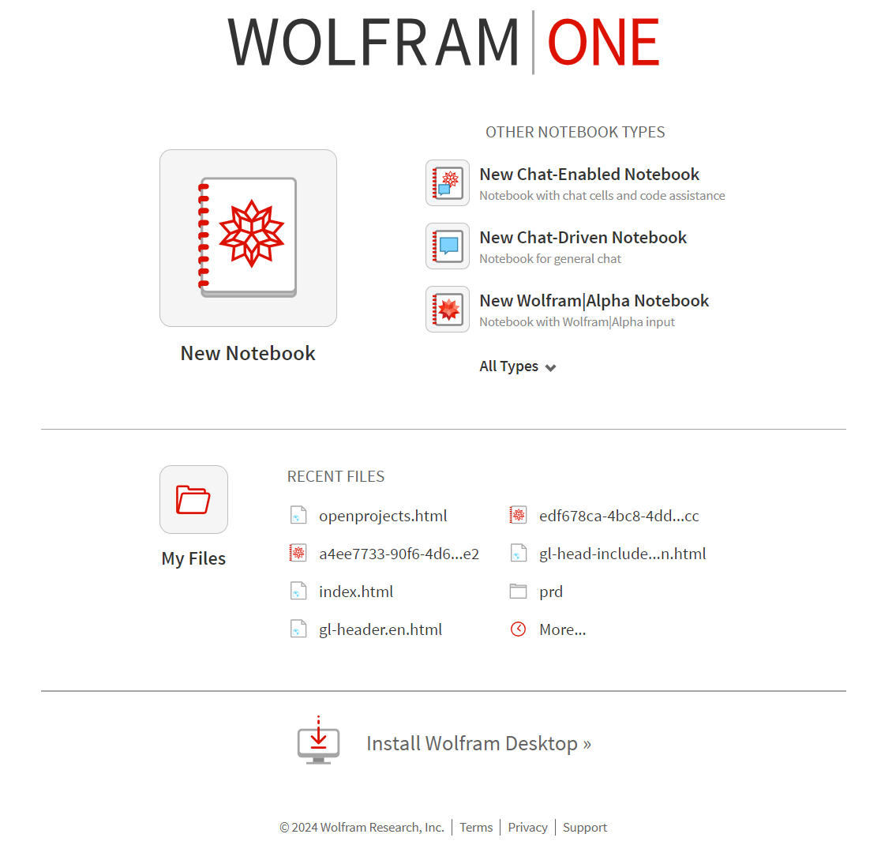
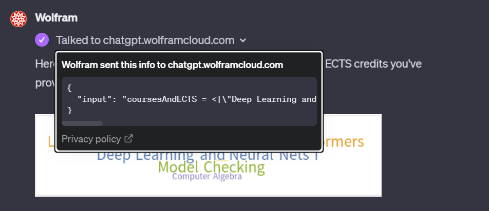

# Wolfram Research: Cloud Project

The Wolfram Tech Stack: Factoring out the computation and knowledge for the current (LLM) trends in AI? In any case, I am super inspired and honored to join this amazing company, contributing to the Cloud Team as a consultant - where the Wolfram cloud product actually seems like an ECM product in many ways, so I am also happy to make some connections across different software product categories here, naturally tying in "math software" with my studies too.

My Masters curriculum actually contains significant components from symbolic computation, situated at [RISC](https://risc.jku.at/), where I also describe some of how that works and what interests me on my [AI page](/rDai), but lately focussing more on my final thesis and project dealing with application of LLMs. I remain excited by Wolfram's own vision for "symbolically enhanced" LLMs, most markedly brought to life by [WolframGPT](https://www.wolfram.com/wolfram-plugin-chatgpt/) recently and work on my own experiments (take my [baby proof of concept python script LLM reporting and summarization tool](/curl) as an example) in addition to my Masters thesis (including [a production-ready, ECM-integration of LLM capability](/rDai#jku-practical)) in that research direction, outlining the symbolic computation  in-roads below, after talking a little more about the Wolfram Research Cloud Project.

## Cloud Project

This is the [product](https://www.wolframcloud.com/) I work on now:

But it is more interesting than what you can see at first glance (I would say, as backend developer) and more than just an extension of Desktop Mathematica, if you know it: it is about the interplay of Wolfam Language and Java, about symbolic computation and web servers, enabling all those nifty http-travels under the hood of a simple Wolfram Language execution.

### [WolframGPT](https://www.wolfram.com/wolfram-plugin-chatgpt/) ...

talks to Wolfram Cloud too, which is of particular interest to me, from a studies point of view.

Let's see if I can detail some work projects in the future, but for now, here are some academic connections I make to this work, especially the Wolfram Language, i.e. Symbolic side, from [my grad studies, especially](/rDai).

## Academic In-Roads

### Computer Algebra

Details to follow.

### Automated Reasoning

Details to follow, asap, promise.

### Theorema and More

I bridged from my <a href="https://risc.jku.at/th/theorema-project-document-processing/">Bachelor's in Software Engineering (thesis details directly from RISC, an international institute with a research focus on various branches of symbolic computation)</a> through the AI components in symbolic described above to my job for Wolfram Research: my Software Engineering thesis treats Wolfram Language as the full-fledged programming language it aims to be! <a href="..\assets\pdf\Tma2TexPresentation1.pdf">Some more on Wolfram Language as an engineering tool in my presentation given about the thesis project (some in DE)</a>

<nav class="nav">
    <ul class="nav__list">
        <a href="/" class="nav__link">
            <i class="ri-home-5-line"></i>
            
                Home
            
        </a>

        <a href="/notes" class="nav__link">
            <i class="ri-swap-line"></i>
            
                Feed
            
        </a>

        <a href="/portfolio" class="nav__link active-link">
            <i class="ri-slideshow-2-line"></i>
            
                Portfolio
            
        </a>

        <a href="/rDai" class="nav__link">
            <i class="ri-robot-line"></i>
            
                AI
            
        </a>

        <a href="/rDse" class="nav__link">
            <i class="ri-command-line"></i>
            
                Software
            
        </a>

        <svg class="indicator" width="94" height="56" xmlns="http://www.w3.org/2000/svg">
            <ellipse cx="47" cy="28" rx="24" ry="28"/>
            <path d="M24 20C24 20 28 55.9999 48 56L0 55.9997C18 55.9998 24 20 24 20Z"/>
            <path d="M70 20C70 20 66 55.9999 46 56L94 55.9997C76 55.9998 70 20 70 20Z"/>
        </svg>
    </ul>

    
</nav>