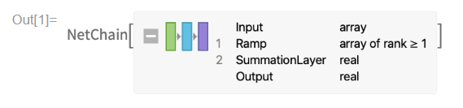

# Wolfram Research: Cloud Project

The Wolfram Tech Stack: Factoring out the computation and knowledge for the current (LLM) trends in AI? In any case, I am super inspired and honored to join this amazing company, contributing to the Cloud Team as a consultant - where the Wolfram cloud product actually seems like an ECM product in many ways, so I am also happy to make some connections across different software product categories here, naturally tying in "math software" with my studies too.

My Masters curriculum actually contains significant components from symbolic computation, situated at [RISC](https://risc.jku.at/), where I also describe some of how that works and what interests me on my [AI page](/rDai), but lately focussing more on my final thesis and project dealing with application of LLMs. I remain excited by Wolfram's own vision for "symbolically enhanced" LLMs, most markedly brought to life by [WolframGPT](https://www.wolfram.com/wolfram-plugin-chatgpt/) recently and work on my own experiments (take my [baby proof of concept python script LLM reporting and summarization tool](/curl) as an example) in addition to my Masters thesis (including [a production-ready, ECM-integration of LLM capability](/rDai#jku-practical)) in that research direction, outlining the symbolic computation  in-roads below, after talking a little more about the Wolfram Research Cloud Project.

## Cloud Project

This is the frontend for the [product](https://www.wolframcloud.com/) I work on:


But it is more interesting than what you can see at first glance (I would say, as backend developer) and more than just an extension of Desktop Mathematica, if you know it: it is about the interplay of Wolfam Language and Java, about symbolic computation and web servers, enabling all those nifty http-travels under the hood of a simple Wolfram Language execution.

## Wolfram Cloud

Let's go a bit deeper: [Here is a Wolfram U recorded public presentation given by past colleague on the Cloud Project](https://www.wolfram.com/broadcast/video.php?c=105&p=8&v=3090), going into some technical details, and also usage of the available Cloud functionality in Wolfram Language (WL). It's all about the notion of a CloudObject, the extended concepts and functionality that lead to Mathematica users being able to deploy expressions to the cloud and doing things with them there. Check out the 15-min mark for how to connect to the cloud right from a notebook and the intro to these concepts ("What is a Cloud Directory?").

**Use this tooling for your own projects!**

[](../assets/pdf/BuildingApplicationsWithTheWolframCloud.pdf)

Shout out to Joel for [the slides he worked on too, used in the presentation linked above! (This is the PDF-version without notebook functionality)](../assets/pdf/BuildingApplicationsWithTheWolframCloud.pdf) 

[Here is the Mathematica Notebook Version for download (recommended)](../assets/pdf/BuildingApplicationsWithTheWolframCloud.nb).

I'd say the most important functionality in the cloud, to get started, is:

```
CloudPut[]
FormFunction[] (* see example below *)
APIFunction[]
```

Here is a concrete example, for a WL-form to send an email and a response message. The form is an expression, like everything else in WL; we store it to the variable `form`.

```
form = CloudPublish[
  FormFunction[{"Name" -> String, "Email" -> "EmailAddress"},
   (
     SendMail[{
       "Subject" -> "New Music Survey Subscriber: " <> #Name,
       "Body" -> StringTemplate["Name:``\nEmail:``"][#Name, #Email]
       }];
     
     "Thank you for your subscription!"
     ) &
   ],
  "contact"
  ]
```

This specifies a form object at a particular URL.


### [WolframGPT](https://www.wolfram.com/wolfram-plugin-chatgpt/) ...

... talks to Wolfram Cloud too, which is of particular interest to me, from a studies-marriage-to-work point of view.


Let's see if I can detail some work projects in the future, but for now, here are some academic connections I make to this work, especially the Wolfram Language, i.e. Symbolic side, from [my grad studies, especially](/rDai): in a sense, I think it comes down to treating a neural-net-based object, be it an LLM or a simpler model without language, as a symbolic expression:

```
In[1] net = NetChain[{ElementwiseLayer[Ramp], SummationLayer[]}]
```



Plugging this into WL, you get a wrapper tool with symbolic and all kinds of under-the-hood capabilites (like cloud connectivity!) that give Machine Learning a unique twist.

## Academic In-Roads

### Computer Algebra

<div id="computer-algebra">

<p>But what about Computer Algebra? (Where WL can be considered a Computer Algebra tool.) I really like this overview:</p>

</div> 


[From RISC](https://risc.jku.at/studying-symbolic-computation/) - situating Computer Algebra somewhat, defining the field for themselves along the way:

> We design and implement algorithms that operate on algebraic expressions; typical application areas are e.g. (algebraic) geometry and (algorithmic) combinatorics.

In practice, which is what I will call those couple of exercises in the subject I visited in the spring of 2024 with RISC, as I was finishing my Software Engineering thesis work as well (which I would situate in Math Software in the Venn diagram above), I got to study with a researcher focussing on sums, and how those can be expressed recursively or algebraically manipulated and used to prove certain problems in their new form. 

As an example I picked up and expressed in a Wolfram Language setup, take the following Pizza Cutting Problem: **How to slice a pizze with n straight cuts so as to maximize the number of slices: how many slices, in terms of n, do you get?** Here is the problem worked and actually solved with Mathematica, using [RSolve](https://reference.wolfram.com/language/ref/RSolve.html) (Solves a recurrence equation!) and [Simplify](https://reference.wolfram.com/language/ref/Simplify.html) mainly:

```
In[1]:= (*Recursive relation*)
Clear[MaxSlices]
MaxSlices[0] = 1;
MaxSlices[n_] := MaxSlices[n - 1] + n

(*Find the closed-form expression*)
rsolve = RSolve[{s[n] == s[n - 1] + n, s[0] == 1}, s[n], n]
simplified = Simplify[rsolve]
```


The results:

```
Out[4]= {{s[n] -> 1/2 (2 + n + n^2)}}

Out[5]= {{s[n] -> 1/2 (2 + n + n^2)}}
```


Code to visualize:

```
MaxPizzaSlices[n_] := n^2/2 + n/2 + 1

(*Display a table of values*)
slicesTable = Table[{n, MaxPizzaSlices[n]}, {n, 0, 10}]
TableForm[slicesTable, 
 TableHeadings -> {None, {"Number of Cuts", "Max Number of Slices"}}]

(*Plot the function*)
Plot[MaxPizzaSlices[n], {n, 0, 10}, 
 AxesLabel -> {"Number of Cuts", "Max Number of Slices"}, 
 PlotStyle -> Red]
```


Visualization results:


**The number of slices grow pretty much exponentially with n cuts and their exact number is expressed by the formula $ n^2/2 + n/2 + 1 $** which is just ... really neat.

Though these kind of problems are fun and get to have serious applications too, I am sure and I know, for example in (quantum, e.g.) physics, I abandoned this extracurricular exercise class somewhat, perhaps for revisiting sometime in the future, to focus on the [thesis project](#theorema-et-al) and consulting work for Wolfram Research, detailed on this page.

_A note on Math Software:_ Somehow, this is what my thesis project is about to me, and I think this aligns with what is being done at RISC - using WL as a language to express Math in software. To me right now, this turns on how math objects, expressions, are represented in WL. I contrast this with the Object Oriented (OO) paradigm, fields and methods and so on, where the functional aspect of a Math expression justifies the "symbolic" expression structure $ Function[FunctionalObject[SymbolicExpression[AllTheSame[]]]] $ - evaluation is structure here, data structure is function. This gets into the Functional paradigm. 

[See below](#theorema-et-al) for the bridging work I am interested in, in this paradigms sense.


### Automated Reasoning

<div id="automated-reasoning">

Details to follow, asap, promise!

</div>

[My Master's degree housekeeping notes](/rDai#housekeeping) shows how the course is part of the (Symbolic Track) AI course at JKU, and from here, I would love to integrate some of the really nice Math courses available at the university, and using Mathematica for myself, into my studies, as time permits.


### Theorema and More

<div id="theorema-et-al">

I bridged from my <a href="https://risc.jku.at/th/theorema-project-document-processing/">Bachelor's in Software Engineering (thesis details directly from RISC, an international institute with a research focus on various branches of symbolic computation)</a> through the AI components in symbolic described above to my job for Wolfram Research: my Software Engineering thesis treats Wolfram Language as the full-fledged programming language it aims to be! <a href="..\assets\pdf\Tma2TexPresentation1.pdf">Some more on Wolfram Language as an engineering tool in my presentation given about the thesis project (some in DE)</a>

</div>

<nav class="nav">
    <ul class="nav__list">
        <a href="/" class="nav__link">
            <i class="ri-home-5-line"></i>
            <span class="nav__name">
                Home
            </span>
        </a>

        <a href="/notes" class="nav__link">
            <i class="ri-swap-line"></i>
            <span class="nav__name">
                Feed
            </span>
        </a>

        <a href="/portfolio" class="nav__link active-link">
            <i class="ri-slideshow-2-line"></i>
            <span class="nav__name">
                Portfolio
            </span>
        </a>

        <a href="/rDai" class="nav__link">
            <i class="ri-robot-line"></i>
            <span class="nav__name">
                AI
            </span>
        </a>

        <a href="/rDse" class="nav__link">
            <i class="ri-command-line"></i>
            <span class="nav__name">
                Software
            </span>
        </a>

        <svg class="indicator" width="94" height="56" xmlns="http://www.w3.org/2000/svg">
            <ellipse cx="47" cy="28" rx="24" ry="28"/>
            <path d="M24 20C24 20 28 55.9999 48 56L0 55.9997C18 55.9998 24 20 24 20Z"/>
            <path d="M70 20C70 20 66 55.9999 46 56L94 55.9997C76 55.9998 70 20 70 20Z"/>
        </svg>
    </ul>

    <script src="{{ site.baseurl }}/assets-liquid-nav/js/main.js"></script>
</nav>